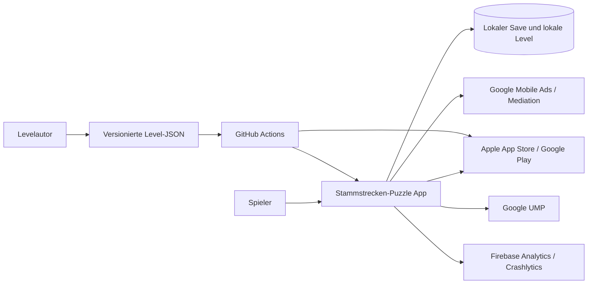

# Stammstrecken-Puzzle – Architecture v0.2

**Status:** Angenommen

**Stand:** 2026-09-08

**Geltungsbereich:** Mobile-Spiel für Android und iOS

**Work Package:** [`WP-002`](../WORK_PACKAGES/WP-002_Architecture-v0.2-Korrekturen.md), aufbauend auf [`WP-001`](../WORK_PACKAGES/WP-001_Technische_Produktionsspezifikation.md)

## 1. Architekturauftrag

Architecture v0.2 übersetzt den bestätigten Produktstand in eine umsetzungsreife technische Grundlage und schließt die zwölf Findings des unabhängigen Sol-Reviews. Sie legt Technologien, zyklusfreie Grenzen, Daten-/Transaktionsverträge, Privacy-Defaults, Qualitätsgates und Releasewege fest. Sie erzeugt **keinen Produktionscode**, keine konkreten Season-1-Rätsel und keine neue Produktentscheidung.

Die Architektur optimiert ausdrücklich für wechselnde KI-Coding-Agenten. Der persistente Projektstand liegt vollständig in Repository, Architecture Decision Records (ADRs), maschinenprüfbaren Datenverträgen und Tests. Kein Implementierungsschritt darf Wissen aus einem Chat voraussetzen.

## 2. Leitende Qualitätsziele

| Priorität | Qualitätsziel | Verbindliche Umsetzung |
|---:|---|---|
| 1 | Fachliche Korrektheit | Reine deterministische Puzzle-Domain, Eindeutigkeits-Solver und Invariantentests. |
| 2 | Agentenwechsel ohne Wissensverlust | Kleine Assemblies, explizite Ports, ADRs, versionierte Formate und keine versteckten Service-Locator. |
| 3 | Offline-Verfügbarkeit | Alle Launchlevel und Kernfunktionen lokal; Netzwerkdienste sind optional und ausfallsicher. |
| 4 | Datenintegrität | Atomare Saves, JCS-Hashprofile, Backups, Migrationen, begrenztes Ledger und idempotente Transaktionen. |
| 5 | Plattformfähigkeit | Eine Unity-Codebasis, IL2CPP, dünne Android-/iOS-Adapter und automatisierte Store-Preflights. |
| 6 | Datenschutz | Native/buildseitige Default-Off-SDKs, explizite Capabilities, Datenminimierung und physische Netzwerk-Smokes. |
| 7 | Reproduzierbarkeit | Gepinnte Toolchain und Pakete, deterministische Content-Importe, Buildmetadaten und CI-Gates. |
| 8 | Einfachheit | Manuelle Composition Root, offizielle Unity-Pakete und keine unnötigen Frameworks. |

## 3. Systemkontext

**Local** ist die Wahrheit für Gameplay-Fortschritt. Stores sind die externe Wahrheit für den nicht konsumierbaren Kauf `remove_ads`; ein clientseitig verifizierter lokaler Grant bleibt bei transientem Storefehler aktiv. Ads, Consent und Telemetrie sind optionale Adapter. Analytics, Crashreports und Ads sind nativ default-off und ihr Ausfall darf Puzzle, Saves, Fortschritt oder verdiente Inhalte nicht blockieren.

## 4. Architekturstil

Das System verwendet eine pragmatische Ports-and-Adapters-Struktur mit einer reinen Domain im Zentrum.

| Ring | Verantwortung | Darf kennen |
|---|---|---|
| `STP.Puzzle.Domain` | Raster, Zellen, Gleise, Befehle, Invarianten, Completion. | Nur .NET/C#-Basisbibliothek. |
| `STP.Puzzle.Solver` | Constraints, Lösungszählung, Proof und Deduktionsspur. | Domain. |
| `STP.Application` | Use Cases, Policies, Fortschritt, Ökonomie, Ports und Orchestrierung. | Domain und Solver. |
| Adapter | Persistenz, Content, Ads, IAP, Consent, Analytics, Crash, Audio und Lifecycle. | Application-Ports und notwendige SDKs. |
| Präsentation | UI Toolkit, Puzzlegrid, Karte und Zugfahrt. | Application Read Models und Commands; keine SDKs. |
| `STP.Bootstrap` | Composition Root und Appstart. | Alle konkreten Module. |

Die verbindliche Feinstruktur steht in [`MODULE_BOUNDARIES.md`](./MODULE_BOUNDARIES.md). Compilerwirksame `.asmdef`-Referenzen müssen diese Richtung erzwingen.

## 5. Laufzeitverantwortung

### 5.1 Startsequenz

1. `Bootstrap` lädt Buildkonfiguration und lokale Content-Manifeste.
2. Persistenzadapter liest Hauptstand, Backup und gegebenenfalls einen vollständig geschriebenen temporären Kandidaten.
3. Save-Migratoren bringen den Snapshot sequenziell auf die aktuelle Version.
4. Application validiert Level-, Campaign-, Completion- und Cosmetics-Kataloge samt Cross-References und Release-Lock.
5. Consent wird aktualisiert; optionale SDKs sind bereits build-/nativ deaktiviert und bleiben bis zu einer explizit bestätigten Capability aus.
6. UI zeigt sofort den lokal verfügbaren Startzustand. Netzwerkfehler erscheinen nicht als blockierender Startscreen.
7. IAP wird nur für Nutzeraktion oder persistente Recovery lazy initialisiert. Telemetrieinitialisierung erfolgt erst nach positiver Capability; beides darf Kernnavigation nicht blockieren.

### 5.2 Puzzleablauf

1. Der Contentadapter liefert ein schema- und semantisch geprüftes `PuzzleDefinition`.
2. Application erzeugt einen `PuzzleSessionState` aus Definition und gegebenenfalls gespeichertem Entwurf.
3. Präsentation sendet ausschließlich Commands; sie verändert keine Zelle direkt.
4. Domain liefert neuen Snapshot, objektive Diagnosehinweise und Domainereignisse.
5. Nach jeder fachlichen Mutation wird der Entwurf gedrosselt, aber crashsicher gespeichert.
6. Bei gültiger A-B-Verbindung emittiert die Domain genau ein `PuzzleSolved`.
7. Application verbucht Fortschritt und Belohnung idempotent über Claimrecords und begrenztes Ledger, bevor die Zugfahrt beginnt.
8. Präsentation zeigt Zugfahrt und Ergebnis in der bestätigten Reihenfolge.
9. Erst nach vollständig sichtbarem Ergebnis und einer nachfolgenden Navigation darf die Ad-Policy eine unterbrechende Anzeige zulassen.

### 5.3 Externe Dienste

Kein externer SDK-Callback darf Domainzustand direkt mutieren. Callbacks werden in typisierte Adapterergebnisse übersetzt, auf den Unity-Hauptthread marshalled und als Application-Command verarbeitet. Jeder Vorgang hat eine korrelationsfähige lokale Operation-ID, Timeout, Abbruchzustand und idempotente Abschlussbehandlung.

## 6. Autoritative Daten und abgeleitete Daten

| Datenart | Autoritative Quelle | Abgeleitet / Cache |
|---|---|---|
| Produktregeln | Konzeptdateien 00–15 | UI-Texte und Read Models. |
| Architektur | Angenommene ADRs und diese Dokumente | Implementierungsdetails. |
| Level | `Content/Levels/**/*.json` nach Schema und Semantikprüfung | Laufzeitkatalog, Addressables, Vorschaubilder. |
| Kampagne/Completion/Kosmetik/Preise | versionierte JSON-Kataloge nach eigenen Schemata | Read Models und Betriebswerkdarstellung. |
| Puzzleentwurf | Lokaler Save-Snapshot | UI-View-State. |
| Fortschritt und Geduldspunkte | Lokaler Save mit Ledgercheckpoint, Journal und terminalen Claimrecords | Karten- und Profildarstellung. |
| Werbefrei-Anspruch | Storetransaktion; lokal gecacht | Ad-Policy-Read-Model. |
| Analytics | Ereignisschema plus freigegebener Adapter | Anbieter-Dashboards. |
| Build | Git-Commit, Tag, Toolchainlock und Contenthash | Storeartefakte. |

Abgeleitete Artefakte dürfen gelöscht und deterministisch neu erzeugt werden. Sie werden nie manuell zur Wahrheit erklärt.

## 7. Dokumentkarte

| Dokument | Verbindlicher Inhalt |
|---|---|
| [`TECH_STACK.md`](./TECH_STACK.md) | Engine, Sprache, Pakete, Plattformbaselines und Dependency-Regeln. |
| [`MODULE_BOUNDARIES.md`](./MODULE_BOUNDARIES.md) | Source-Struktur, Assemblies, Ports und erlaubte Abhängigkeiten. |
| [`GAME_STATE_MODEL.md`](./GAME_STATE_MODEL.md) | Persistenter und flüchtiger Zustand, Commands, Phasen und Undo. |
| [`LEVEL_DATA_FORMAT.md`](./LEVEL_DATA_FORMAT.md) | JSON-Vertrag, Versionierung, Hashing und Migration. |
| [`PUZZLE_ENGINE.md`](./PUZZLE_ENGINE.md) | Domaininvarianten, Übergänge und Completion-Validierung. |
| [`SOLVER_ARCHITECTURE.md`](./SOLVER_ARCHITECTURE.md) | Constraint-Modell, Lösungslimit, Proofs und Generatorprüfung. |
| [`PERSISTENCE.md`](./PERSISTENCE.md) | Saves, atomare Writes, Wiederherstellung, Migration und Offline-First. |
| [`MOBILE_SERVICES.md`](./MOBILE_SERVICES.md) | Ads, IAP, Consent, Analytics, Audio und Plattformadapter. |
| [`CONTENT_PIPELINE.md`](./CONTENT_PIPELINE.md) | Levelauthoring, Import, Assets und Lokalisierung. |
| [`CONTENT_CATALOGS.md`](./CONTENT_CATALOGS.md) | Kampagne, Completion, Rewards, Kosmetik, Preise, Ownership und Cross-References. |
| [`OBSERVABILITY.md`](./OBSERVABILITY.md) | Logging, Events, Crashdiagnose und Datenschutz. |
| [`TEST_STRATEGY.md`](./TEST_STRATEGY.md) | Testpyramide, Invarianten, Geräteprüfungen und Gates. |
| [`BUILD_AND_RELEASE.md`](./BUILD_AND_RELEASE.md) | Buildprofile, CI, Signing, Storetracks und Releasebelege. |
| [`OPEN_BLOCKERS.md`](./OPEN_BLOCKERS.md) | Echte fehlende Produktentscheidungen, blockierte Teilbereiche und Unblock-Bedingungen. |

## 8. Nicht verhandelbare technische Guardrails

1. Domain und Solver referenzieren weder `UnityEngine` noch externe SDKs.
2. Die sechs Gleisformen und vier nicht konkreten Zellzustände werden nicht erweitert, solange keine neue Produktentscheidung und Ruleset-Version vorliegt.
3. Gelbe Auswahl ist ausschließlich Präsentationszustand.
4. Kein System vergleicht einen Zwischenstand mit der gespeicherten Lösung, um plausible Annahmen als falsch zu markieren.
5. Eine gültige Lösung wird vollständig aus Regeln berechnet, nicht durch Gleichheit mit der Authoring-Lösung.
6. Werbung kann nur über die Application-Ad-Policy freigegeben werden und niemals während Puzzle, Lösungserkennung, Zugfahrt oder Ergebnisaufbau erscheinen.
7. Hilfsmarkierungen und Hinweise verändern keine Sterne; Hinweise beeinflussen nur das Profilmerkmal „direkt gelöst“.
8. Fortschritt, Währung und externe Rewards werden idempotent verbucht und nie aus Analytics rekonstruiert.
9. Externe SDKs dürfen bei fehlendem Consent oder Fehler vollständig ausgeschaltet bleiben.
10. Keine sichtbaren Strings, Assetpfade, Produkt-IDs oder SDK-Schlüssel werden in Domainlogik hart codiert.
11. Jede neue Modulreferenz, Datenversion, externe SDK-Linie oder Plattformbaseline benötigt Prüfung gegen die ADRs.
12. Kein Agent darf ein fehlschlagendes Gate durch Retry, Testlöschung oder stilles Downgrade umgehen.
13. Savehashes verwenden ein benanntes Profil mit RFC-8785-Bytes; ein unbekanntes Profil ist nicht automatisch Korruption.
14. Der fachliche `POST_CLEAR_PATIENCE`-Claim ist pro Meldung und Placement eindeutig; Provider-IDs sind nur Auditdaten.
15. IAP-Entitlement wird vor Google Acknowledge beziehungsweise Apple Finish atomar persistiert und idempotent reconciled.
16. Emulator oder Simulator allein erfüllt kein physisches Geräte- oder Privacy-Smoke-Gate.

## 9. Anforderungsabdeckung

| Auftragsanforderung | Primärdokument | Entscheidung |
|---|---|---|
| Engine, Release-Linie, Sprache und Plattformbaselines | `TECH_STACK.md` | ADR-001, ADR-002, ADR-012 |
| Source-Struktur und Modulgrenzen | `MODULE_BOUNDARIES.md` | ADR-013 ersetzt ADR-003 |
| Zustands-, Feld-, Werkzeug- und Gleismodell | `GAME_STATE_MODEL.md`, `PUZZLE_ENGINE.md` | ADR-005 |
| Leveldaten, Versionierung und Migration | `LEVEL_DATA_FORMAT.md` | ADR-004, ADR-016 |
| Puzzlevalidierung | `PUZZLE_ENGINE.md` | ADR-005 |
| Solver, Eindeutigkeit, Generatorvalidierung | `SOLVER_ARCHITECTURE.md` | ADR-007 |
| Automatisierte Tests | `TEST_STRATEGY.md` | ADR-009 |
| Levelauthoring | `CONTENT_PIPELINE.md` | ADR-004 |
| Kampagne, Completion, Kosmetik und Preise | `CONTENT_CATALOGS.md` | ADR-016 |
| Savegames, Hashprofil, Ledger und Offline-First | `PERSISTENCE.md` | ADR-014 ersetzt ADR-006 |
| Android-/iOS-Abstraktionen | `MOBILE_SERVICES.md` | ADR-015 ersetzt ADR-008 |
| Ads, IAP und Kaufwiederherstellung | `MOBILE_SERVICES.md`, `PERSISTENCE.md` | ADR-015 |
| Analytics, Consent und Datenschutz | `OBSERVABILITY.md`, `MOBILE_SERVICES.md` | ADR-015, ADR-010 |
| Audio, Assets und Lokalisierung | `CONTENT_PIPELINE.md`, `MOBILE_SERVICES.md` | ADR-011 |
| Build, CI und Release | `BUILD_AND_RELEASE.md` | ADR-010, ADR-017 |
| Logging und Fehlerdiagnose | `OBSERVABILITY.md` | ADR-010 |
| Reproduzierbarer Architekturvalidator | `tools/architecture-validation/README.md` | ADR-017 ersetzt ADR-009 |
| Fehlende Produktentscheidungen | `OPEN_BLOCKERS.md` | fail-closed Folgeblocker |

## 10. Offene Grenzen und Blockerstatus

Architecture v0.2 ist als technische Grundlage vollständig, enthält aber drei echte, bewusst nicht durch Annahmen gelöste **Folgeblocker**. [`OPEN_BLOCKERS.md`](./OPEN_BLOCKERS.md) ist das autoritative Register:

1. `BLOCKER-PROD-001` blockiert die finale Hint-Entitlement-/Economy-Implementierung.
2. `BLOCKER-PROD-002` blockiert die Anspruchslogik der Betriebslage des Tages.
3. `BLOCKER-PROD-003` blockiert die Veröffentlichung generierter Dauerbaustellenlevel.

Diese Blocker verhindern nicht die Abnahme der Architektur, weil sie den fehlenden Produktentscheid präzise, fail-closed und mit Unblock-Bedingungen dokumentiert. Sie verhindern ausdrücklich die Fertigmeldung des jeweils betroffenen späteren Implementierungs- oder Content-Work-Packages.

Weitere bestätigte offene Produktpunkte werden bewusst nicht entschieden und blockieren die technische Grundlage nicht: finaler Werbefrei-Preis, konkrete Sternzeitwerte, finale Touchgesten, finale Accessibility-Ausgestaltung, finale Orientierung, finale Marke/Assets und der konkrete Zugkatalog.

Vor einem öffentlichen Release sind jedoch externe Freigaben und Zugänge erforderlich: Storekonten, Produkt-IDs, AdMob-/Firebase-Konfiguration, Signingmaterial, Datenschutzerklärung, Consenttexte sowie die rechtliche Prüfung von Marke und Storematerial. Diese Voraussetzungen werden in `BUILD_AND_RELEASE.md` als Release-Gates geführt und nicht als bereits erledigt dargestellt.

## 11. Änderungsverfahren

Eine technische Änderung beginnt mit einem regelkonformen Work Package `WP-###`. Berührt sie eine angenommene Entscheidung wesentlich, wird ein neuer ADR erstellt, der den alten ausdrücklich und bidirektional ersetzt. Datenverträge ändern sich nur mit Schema-/Save-/Hashprofilversion, Migration und Rückwärtskompatibilitätstest. Architektur und Implementierung werden niemals allein über Chatabsprachen geändert.

## Referenzen

[1]: ../AGENTS.md "Verbindliche Agentenleitlinie"
[2]: ../Stammstrecken_Puzzle_Konzept_00-15/09_Train_Track_Master_Spezifikation.md "Stammstrecken-Puzzle – Master-Spezifikation"
[3]: ../Stammstrecken_Puzzle_Konzept_00-15/15_Projektuebergabe_und_Gesamtstatus.md "Stammstrecken-Puzzle – Projektübergabe und Gesamtstatus"
[4]: ../DECISIONS/ADR-001-unity-6-3-lts.md "ADR-001 – Unity 6.3 LTS als Game Engine"
[5]: ../DECISIONS/README.md "Verbindlicher ADR-Index"
[6]: ../DECISIONS/ADR-013-zyklusfreie-ports-und-modulgrenzen.md "ADR-013 – Zyklusfreie Ports und Modulgrenzen"
[7]: ../DECISIONS/ADR-014-save-kanonisierung-und-ledgerkompaktierung.md "ADR-014 – Save-Kanonisierung und Ledgerkompaktierung"
[8]: ../DECISIONS/ADR-015-mobile-transaktionen-und-privacy-default-off.md "ADR-015 – Mobile Transaktionen und Privacy Default-Off"
[9]: ../DECISIONS/ADR-016-katalogvertraege-und-endless-identitaet.md "ADR-016 – Katalogverträge und Endless-Identität"
[10]: ../DECISIONS/ADR-017-versionierter-architekturvalidator.md "ADR-017 – Versionierter Architekturvalidator"
