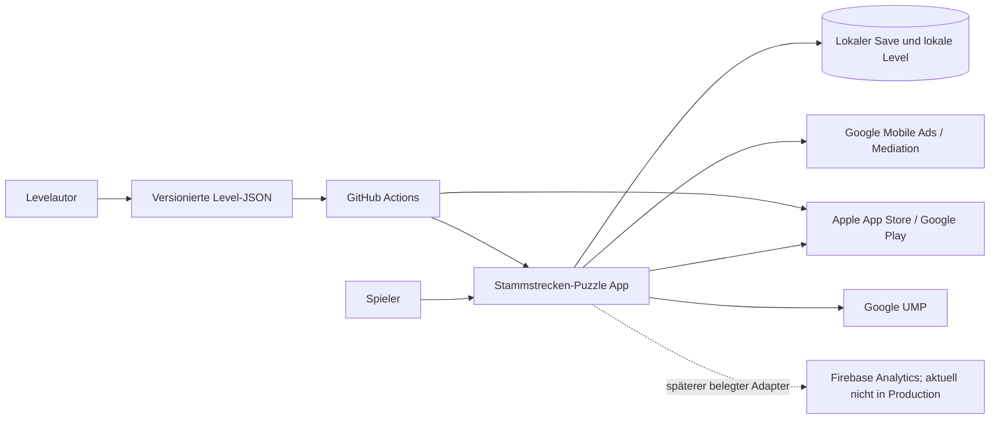

# Stammstrecken-Puzzle – Architecture v0.5

**Status:** Angenommen

**Stand:** 2026-09-13

**Geltungsbereich:** Mobile-Spiel für Android und iOS

**Work Package:** [`WP-005`](../WORK_PACKAGES/WP-005_Architecture-v0.5-letzte-High-Korrekturen.md), aufbauend auf [`WP-001`](../WORK_PACKAGES/WP-001_Technische_Produktionsspezifikation.md) bis [`WP-004`](../WORK_PACKAGES/WP-004_Architecture-v0.4-Abschlusskorrekturen.md)

## 1. Architekturauftrag

Architecture v0.5 übernimmt den bestätigten Produktstand und Architecture v0.4 unverändert, schließt aber vier letzte HIGH-Lücken: den providerfreien Endless-Skip mit Race-Schutz, die bindende Cosmetics-Reservation vor Ownershipcommit, den vollständig evidenzgebundenen Rolloutreducer und den gemeinsamen historischen Work-Package-/Scope-Trust-Anchor. Sie erzeugt **keinen Produktionscode**, keine konkreten Season-1-Rätsel und keine neue Produktentscheidung.

Die Architektur optimiert ausdrücklich für wechselnde KI-Coding-Agenten. Der persistente Projektstand liegt vollständig in Repository, Architecture Decision Records (ADRs), maschinenprüfbaren Datenverträgen und Tests. Kein Implementierungsschritt darf Wissen aus einem Chat voraussetzen.

| Finding | Status | Verbindlicher Abschluss |
|---|---|---|
| `V03-001` | **CLOSED** | Prä-SDK-Deny-Fence, direkte Legacy-Upgrades, `REVOKE_PENDING`/Reconciliation und fail-closed Productionausschluss. |
| `V03-002` | **CLOSED** | Persistierte Reservation, reproduzierbare Generation, offener Completionclaim und begrenzte Kompaktierung. |
| `V03-003` | **CLOSED** | Ausführbare Reducer-/Cross-Reference-Prüfungen, gezielte Mutationen und sieben getrennte Evidenzkategorien. |
| `V03-004` | **CLOSED** | Alle v1-Fokuswerte bleiben v2-kompatibel; DRAFT-Cosmetics sind authoringgültig und runtimegesperrt. |
| `V03-005` | **CLOSED** | Segmentglobs, kanonischer Repositorypfad und vorab unveränderlich verankertes WP-Scope-Manifest. |
| `V03-006` | **CLOSED** | Historischer ADR-016-Entscheidungskörper restauriert; aktuelle Normen ausschließlich in Nachfolge-ADRs. |
| `V03-007` | **CLOSED** | Plattformgebundene Store-Crashrate mit Mindestpopulation, Freshness und `PAUSE_NO_ADVANCE`. |
| `HIGH-001` | **CLOSED** | `LOCAL_DECISION_PENDING`, lokaler Skip ohne Provider-ID/Ledgerdelta, providerseitige Vorabreservation und deterministische Race-/Callback-Behandlung. |
| `HIGH-002` | **CLOSED** | Eligibility-validierte persistierte Cosmetics-Reservation mit vollständiger Claim-, Katalog- und Projektionsbindung vor atomarem Ownershipcommit. |
| `HIGH-003` | **CLOSED** | Vollständiger Android-/iOS-Evidenzreducer für Population, Fenster, Freshness, Quelle, Metrik sowie Release-/Buildbindung; jede Lücke pausiert. |
| `HIGH-004` | **CLOSED** | Work Package und Scope-Manifest werden aus demselben historischen Add-Commit geladen und dort exakt miteinander verlinkt. |

## 2. Leitende Qualitätsziele

| Priorität | Qualitätsziel | Verbindliche Umsetzung |
|---:|---|---|
| 1 | Fachliche Korrektheit | Reine deterministische Puzzle-Domain, Eindeutigkeits-Solver und Invariantentests. |
| 2 | Agentenwechsel ohne Wissensverlust | Kleine Assemblies, explizite Ports, ADRs, versionierte Formate und keine versteckten Service-Locator. |
| 3 | Offline-Verfügbarkeit | Alle Launchlevel und Kernfunktionen lokal; Netzwerkdienste sind optional und ausfallsicher. |
| 4 | Datenintegrität | Atomare Saves, JCS-Hashprofile, Backups, Migrationen, begrenztes Ledger und idempotente Transaktionen. |
| 5 | Plattformfähigkeit | Eine Unity-Codebasis, IL2CPP, dünne Android-/iOS-Adapter und automatisierte Store-Preflights. |
| 6 | Datenschutz | Native/buildseitige Default-Off-SDKs, explizite Capabilities, Datenminimierung und physische Netzwerk-Smokes. |
| 7 | Reproduzierbarkeit | Gepinnte Toolchain und Pakete, deterministische Content-Importe, Buildmetadaten und CI-Gates. |
| 8 | Einfachheit | Manuelle Composition Root, offizielle Unity-Pakete und keine unnötigen Frameworks. |

## 3. Systemkontext

**Local** ist die Wahrheit für Gameplay-Fortschritt. Stores sind die externe Wahrheit für den nicht konsumierbaren Kauf `remove_ads`; ein clientseitig verifizierter lokaler Grant bleibt bei transientem Storefehler aktiv. Ads und Consent sind optionale Adapter. Analytics bleibt bis zum belegten prä-SDK-Deny-Fence aus Production ausgeschlossen; Crashlytics ist im Productionprofil ausgeschlossen. Ihr Ausfall darf Puzzle, Saves, Fortschritt oder verdiente Inhalte nicht blockieren.

## 4. Architekturstil

Das System verwendet eine pragmatische Ports-and-Adapters-Struktur mit einer reinen Domain im Zentrum.

| Ring | Verantwortung | Darf kennen |
|---|---|---|
| `STP.Puzzle.Domain` | Raster, Zellen, Gleise, Befehle, Invarianten, Completion. | Nur .NET/C#-Basisbibliothek. |
| `STP.Puzzle.Solver` | Constraints, Lösungszählung, Proof und Deduktionsspur. | Domain. |
| `STP.Application` | Use Cases, Policies, Fortschritt, Ökonomie, Ports und Orchestrierung. | Domain und Solver. |
| Adapter | Persistenz, Content, Ads, IAP, Consent, Analytics, lokale Crashdiagnose, Audio und Lifecycle. | Application-Ports und notwendige SDKs. |
| Präsentation | UI Toolkit, Puzzlegrid, Karte und Zugfahrt. | Application Read Models und Commands; keine SDKs. |
| `STP.Bootstrap` | Composition Root und Appstart. | `STP.Application` sowie alle konkreten Adapter-/Präsentationsmodule; Domain/Solver nur transitiv. |

Die verbindliche Feinstruktur steht in [`MODULE_BOUNDARIES.md`](./MODULE_BOUNDARIES.md). Compilerwirksame `.asmdef`-Referenzen müssen diese Richtung erzwingen.

## 5. Laufzeitverantwortung

### 5.1 Startsequenz

1. `Bootstrap` lädt Buildkonfiguration und lokale Content-Manifeste.
2. Persistenzadapter liest Hauptstand, Backup und gegebenenfalls einen vollständig geschriebenen temporären Kandidaten.
3. Save-Migratoren bringen den Snapshot sequenziell auf Save v2.
4. Application validiert Level-v2-, Campaign-v2-, Completion-v1- und Cosmetics-v2-Kataloge samt Cross-References, Proofs und Release-Lock.
5. Vor optionaler SDK-Erfassung erzwingt der Bootstrapfence Native deny; der PrivacyCoordinator beginnt effective fail-closed, validiert Entscheid und `nativeSyncState`, reconciliiert Pending-Zustände, aktualisiert UMP und wendet nur belegte native Effekte an. Analytics und Crashlytics bleiben im aktuellen Productionprofil ausgeschlossen.
6. UI zeigt sofort den lokal verfügbaren Startzustand. Netzwerkfehler erscheinen nicht als blockierender Startscreen.
7. IAP wird nur für Nutzeraktion oder persistente Recovery plus Release-Readiness lazy initialisiert. Analytics wird im aktuellen Productionprofil nicht initialisiert; Crashlytics ist in Production nicht vorhanden.

### 5.2 Puzzleablauf

1. Der Contentadapter liefert ein schema- und semantisch geprüftes `PuzzleDefinition`.
2. Application erzeugt einen `PuzzleSessionState` aus Definition und gegebenenfalls gespeichertem Entwurf.
3. Präsentation sendet ausschließlich Commands; sie verändert keine Zelle direkt.
4. Domain liefert neuen Snapshot, objektive Diagnosehinweise und Domainereignisse.
5. Nach jeder fachlichen Mutation wird der Entwurf gedrosselt, aber crashsicher gespeichert.
6. Bei gültiger A-B-Verbindung emittiert die Domain genau ein `PuzzleSolved`.
7. Application verbucht Fortschritt und Belohnung idempotent über Claimrecords und begrenztes Ledger, bevor die Zugfahrt beginnt.
8. Präsentation zeigt Zugfahrt und Ergebnis in der bestätigten Reihenfolge.
9. Erst nach vollständig sichtbarem Ergebnis und einer nachfolgenden Navigation darf die Ad-Policy eine unterbrechende Anzeige zulassen.

### 5.3 Externe Dienste

Kein externer SDK-Callback darf Domainzustand direkt mutieren. Callbacks werden in typisierte Adapterergebnisse übersetzt, auf den Unity-Hauptthread marshalled und als Application-Command verarbeitet. Jeder Vorgang hat eine korrelationsfähige lokale Operation-ID, Timeout, Abbruchzustand und idempotente Abschlussbehandlung.

## 6. Autoritative Daten und abgeleitete Daten

| Datenart | Autoritative Quelle | Abgeleitet / Cache |
|---|---|---|
| Produktregeln | Konzeptdateien 00–15 | UI-Texte und Read Models. |
| Architektur | Angenommene ADRs und diese Dokumente | Implementierungsdetails. |
| Level | `Content/Levels/**/*.json` nach Schema und Semantikprüfung | Laufzeitkatalog, Addressables, Vorschaubilder. |
| Kampagne/Completion/Kosmetik/Preise | versionierte JSON-Kataloge nach eigenen Schemata | Read Models und Betriebswerkdarstellung. |
| Puzzleentwurf | Lokaler Save-Snapshot | UI-View-State. |
| Fortschritt und Geduldspunkte | Lokaler Save mit Ledgercheckpoint, Journal und terminalen Claimrecords | Karten- und Profildarstellung. |
| Werbefrei-Anspruch | Storetransaktion; lokal gecacht | Ad-Policy-Read-Model. |
| Analytics | Ereignisschema plus freigegebener Adapter | Anbieter-Dashboards. |
| Build | Git-Commit, Tag, Toolchainlock und Contenthash | Storeartefakte. |

Abgeleitete Artefakte dürfen gelöscht und deterministisch neu erzeugt werden. Sie werden nie manuell zur Wahrheit erklärt.

## 7. Dokumentkarte

| Dokument | Verbindlicher Inhalt |
|---|---|
| [`TECH_STACK.md`](./TECH_STACK.md) | Engine, Sprache, Pakete, Plattformbaselines und Dependency-Regeln. |
| [`MODULE_BOUNDARIES.md`](./MODULE_BOUNDARIES.md) | Source-Struktur, Assemblies, Ports und erlaubte Abhängigkeiten. |
| [`GAME_STATE_MODEL.md`](./GAME_STATE_MODEL.md) | Persistenter und flüchtiger Zustand, Commands, Phasen und Undo. |
| [`LEVEL_DATA_FORMAT.md`](./LEVEL_DATA_FORMAT.md) | JSON-Vertrag, Versionierung, Hashing und Migration. |
| [`PUZZLE_ENGINE.md`](./PUZZLE_ENGINE.md) | Domaininvarianten, Übergänge und Completion-Validierung. |
| [`SOLVER_ARCHITECTURE.md`](./SOLVER_ARCHITECTURE.md) | Constraint-Modell, Lösungslimit, Proofs und Generatorprüfung. |
| [`PERSISTENCE.md`](./PERSISTENCE.md) | Saves, atomare Writes, Wiederherstellung, Migration und Offline-First. |
| [`MOBILE_SERVICES.md`](./MOBILE_SERVICES.md) | Ads, IAP, Consent, Analytics, Audio und Plattformadapter. |
| [`CONTENT_PIPELINE.md`](./CONTENT_PIPELINE.md) | Levelauthoring, Import, Assets und Lokalisierung. |
| [`CONTENT_CATALOGS.md`](./CONTENT_CATALOGS.md) | Kampagne, Completion, Rewards, Kosmetik, Preise, Ownership und Cross-References. |
| [`OBSERVABILITY.md`](./OBSERVABILITY.md) | Logging, Events, Crashdiagnose und Datenschutz. |
| [`TEST_STRATEGY.md`](./TEST_STRATEGY.md) | Testpyramide, Invarianten, Geräteprüfungen und Gates. |
| [`BUILD_AND_RELEASE.md`](./BUILD_AND_RELEASE.md) | Buildprofile, CI, Signing, Storetracks und Releasebelege. |
| [`OPEN_BLOCKERS.md`](./OPEN_BLOCKERS.md) | Echte fehlende Produktentscheidungen, blockierte Teilbereiche und Unblock-Bedingungen. |
| [`PRIVACY_PROVIDER_EVIDENCE.md`](./PRIVACY_PROVIDER_EVIDENCE.md) | Herstellerbelege für SDK-Pins, Analytics-Reset, Crash-Ausschluss, UMP und IAP-Datenfluss. |

## 8. Nicht verhandelbare technische Guardrails

1. Domain und Solver referenzieren weder `UnityEngine` noch externe SDKs.
2. Die sechs Gleisformen und vier nicht konkreten Zellzustände werden nicht erweitert, solange keine neue Produktentscheidung und Ruleset-Version vorliegt.
3. Gelbe Auswahl ist ausschließlich Präsentationszustand.
4. Kein System vergleicht einen Zwischenstand mit der gespeicherten Lösung, um plausible Annahmen als falsch zu markieren.
5. Eine gültige Lösung wird vollständig aus Regeln berechnet, nicht durch Gleichheit mit der Authoring-Lösung.
6. Werbung kann nur über die Application-Ad-Policy freigegeben werden und niemals während Puzzle, Lösungserkennung, Zugfahrt oder Ergebnisaufbau erscheinen.
7. Hilfsmarkierungen und Hinweise verändern keine Sterne; Hinweise beeinflussen nur das Profilmerkmal „direkt gelöst“.
8. Fortschritt, Währung und externe Rewards werden idempotent verbucht und nie aus Analytics rekonstruiert.
9. Externe SDKs dürfen bei fehlendem Consent oder Fehler vollständig ausgeschaltet bleiben.
10. Keine sichtbaren Strings, Assetpfade, Produkt-IDs oder SDK-Schlüssel werden in Domainlogik hart codiert.
11. Jede neue Modulreferenz, Datenversion, externe SDK-Linie oder Plattformbaseline benötigt Prüfung gegen die ADRs.
12. Kein Agent darf ein fehlschlagendes Gate durch Retry, Testlöschung oder stilles Downgrade umgehen.
13. Savehashes verwenden ein benanntes Profil mit RFC-8785-Bytes; ein unbekanntes Profil ist nicht automatisch Korruption.
14. Der fachliche `POST_CLEAR_PATIENCE`-Claim ist pro Meldung und Placement eindeutig; Provider-IDs sind nur Auditdaten.
15. IAP-Entitlement wird vor Google Acknowledge beziehungsweise Apple Finish atomar persistiert und idempotent reconciled.
16. Emulator oder Simulator allein erfüllt kein physisches Geräte- oder Privacy-Smoke-Gate.
17. Endless-Deduplikation beruht auf Save-v2-Watermark plus höchstens 20 offenen Reservation-/Draft-/Claimfortsetzungen und besitzt keine terminale Nutzungsgrenze außer UInt64-Erschöpfung.
18. Puzzle-ID, Dokumentformat und Proofversion sind getrennte Achsen; Hashprofile werden immer mitgeführt.
19. Ein Releasekandidat wird mit Productionidentität gebaut und exakt ohne Rebuild promotet; Stagingartefakte sind nie promotable.
20. Ein lokaler Architekturcheck darf nicht als ausgeführter Unity-, Geräte-, SDK- oder Storetest berichtet werden.
21. Ein Scope-Manifest ist nur vertrauenswürdig, wenn Manifest und zugehöriges Work Package im selben historischen Add-Commit eingeführt wurden, dessen Elterncommit dem `baseCommit` entspricht, und der historische WP-Blob exakt auf dieses Manifest verweist.
22. DRAFT-Cosmetics sind authoringgültig, aber niemals runtime-kauf- oder grantfähig.
23. Fehlende oder nicht exakt releasegebundene Store-Crashdaten pausieren den Rollout und gelten nie als bestandene Schwelle.
24. Ein Endless-No-Reward-Skip ist lokal, rewardfrei und providerfrei; jeder Providerpfad reserviert seine Operation vor SDK-Aufruf und konkurriert über dieselbe Savegeneration.
25. Ein kosmetischer Meilensteinclaim kann ohne persistierte, eligibility-validierte und vollständig gebundene Reservation niemals Ownership schreiben.
26. Ein Rollout darf nur bei vollständiger, frischer, stufen- und buildgebundener Plattform-Evidenz fortschreiten; jede fehlende Dimension liefert `PAUSE_NO_ADVANCE`.

## 9. Anforderungsabdeckung

| Auftragsanforderung | Primärdokument | Entscheidung |
|---|---|---|
| Engine, Release-Linie, Sprache und Plattformbaselines | `TECH_STACK.md` | ADR-001, ADR-002, ADR-012 |
| Source-Struktur und Modulgrenzen | `MODULE_BOUNDARIES.md` | ADR-013 ersetzt ADR-003; ADR-018 ergänzt Bootstrap |
| Zustands-, Feld-, Werkzeug- und Gleismodell | `GAME_STATE_MODEL.md`, `PUZZLE_ENGINE.md` | ADR-005 |
| Leveldaten, Versionierung und Migration | `LEVEL_DATA_FORMAT.md` | ADR-021 ersetzt ADR-004 |
| Puzzlevalidierung | `PUZZLE_ENGINE.md` | ADR-005 |
| Solver, Eindeutigkeit, Generatorvalidierung | `SOLVER_ARCHITECTURE.md` | ADR-007, ADR-019, ADR-021 |
| Automatisierte Tests und Scope | `TEST_STRATEGY.md` | ADR-026 ersetzt ADR-022/ADR-017/ADR-009; ADR-030 präzisiert den gemeinsamen historischen WP-/Manifestanker |
| Levelauthoring | `CONTENT_PIPELINE.md` | ADR-021 ersetzt ADR-004 |
| Kampagne, Completion, Kosmetik und Preise | `CONTENT_CATALOGS.md` | ADR-016, ADR-023; ADR-028 präzisiert Cosmetics-Reservation und Commitbindung |
| Savegames, Hashprofil, Ledger und Offline-First | `PERSISTENCE.md` | ADR-019 ersetzt ADR-014/ADR-006; ADR-025 präzisiert Open-Lifecycle und Claims; ADR-027 ergänzt den lokalen Skip |
| Android-/iOS-Abstraktionen | `MOBILE_SERVICES.md` | ADR-020 ersetzt ADR-015/ADR-008; ADR-024 präzisiert Analytics-Lifecycle |
| Ads, IAP und Kaufwiederherstellung | `MOBILE_SERVICES.md`, `PERSISTENCE.md` | ADR-020 |
| Analytics, Consent und Datenschutz | `OBSERVABILITY.md`, `MOBILE_SERVICES.md` | ADR-024 ersetzt Teil von ADR-020; ADR-020 ersetzt Production-Crashteil von ADR-010 |
| Audio, Assets und Lokalisierung | `CONTENT_PIPELINE.md`, `MOBILE_SERVICES.md` | ADR-011 |
| Build, CI und Release | `BUILD_AND_RELEASE.md` | ADR-010, ADR-023, ADR-026; ADR-029 präzisiert Rolloutevidenz, ADR-030 den Trust-Anchor |
| Logging und Fehlerdiagnose | `OBSERVABILITY.md` | ADR-010 |
| Reproduzierbarer Architekturvalidator | `tools/architecture-validation/README.md` | ADR-026 ersetzt ADR-022/ADR-017/ADR-009 |
| Fehlende Produktentscheidungen | `OPEN_BLOCKERS.md` | fail-closed Folgeblocker |

## 10. Offene Grenzen und Blockerstatus

Architecture v0.5 ist als technische Grundlage vollständig, enthält aber drei echte, bewusst nicht durch Annahmen gelöste **Folgeblocker**. [`OPEN_BLOCKERS.md`](./OPEN_BLOCKERS.md) ist das autoritative Register:

1. `BLOCKER-PROD-001` blockiert die finale Hint-Entitlement-/Economy-Implementierung.
2. `BLOCKER-PROD-002` blockiert die Anspruchslogik der Betriebslage des Tages.
3. `BLOCKER-PROD-003` blockiert die Veröffentlichung generierter Dauerbaustellenlevel.

Diese Blocker verhindern nicht die Abnahme der Architektur, weil sie den fehlenden Produktentscheid präzise, fail-closed und mit Unblock-Bedingungen dokumentiert. Sie verhindern ausdrücklich die Fertigmeldung des jeweils betroffenen späteren Implementierungs- oder Content-Work-Packages.

Weitere bestätigte offene Produktpunkte werden bewusst nicht entschieden und blockieren die technische Grundlage nicht: finaler Werbefrei-Preis, konkrete Sternzeitwerte, finale Touchgesten, finale Accessibility-Ausgestaltung, finale Orientierung, finale Marke/Assets und der konkrete Zugkatalog.

Vor einem öffentlichen Release sind jedoch externe Freigaben und Zugänge erforderlich: Storekonten, Produkt-IDs, AdMob-/Firebase-Konfiguration, Signingmaterial, Datenschutzerklärung, Consenttexte sowie die rechtliche Prüfung von Marke und Storematerial. Diese Voraussetzungen werden in `BUILD_AND_RELEASE.md` als Release-Gates geführt und nicht als bereits erledigt dargestellt.

## 11. Änderungsverfahren

Eine technische Änderung beginnt mit einem regelkonformen Work Package `WP-###`. Berührt sie eine angenommene Entscheidung wesentlich, wird ein neuer ADR erstellt, der den alten ausdrücklich und bidirektional ersetzt. Datenverträge ändern sich nur mit Schema-/Save-/Hashprofilversion, Migration und Rückwärtskompatibilitätstest. Architektur und Implementierung werden niemals allein über Chatabsprachen geändert.

## Referenzen

[1]: ../AGENTS.md "Verbindliche Agentenleitlinie"
[2]: ../Stammstrecken_Puzzle_Konzept_00-15/09_Train_Track_Master_Spezifikation.md "Stammstrecken-Puzzle – Master-Spezifikation"
[3]: ../Stammstrecken_Puzzle_Konzept_00-15/15_Projektuebergabe_und_Gesamtstatus.md "Stammstrecken-Puzzle – Projektübergabe und Gesamtstatus"
[4]: ../DECISIONS/ADR-001-unity-6-3-lts.md "ADR-001 – Unity 6.3 LTS als Game Engine"
[5]: ../DECISIONS/README.md "Verbindlicher ADR-Index"
[6]: ../DECISIONS/ADR-013-zyklusfreie-ports-und-modulgrenzen.md "ADR-013 – Zyklusfreie Ports und Modulgrenzen"
[7]: ../DECISIONS/ADR-014-save-kanonisierung-und-ledgerkompaktierung.md "ADR-014 – Save-Kanonisierung und Ledgerkompaktierung"
[8]: ../DECISIONS/ADR-015-mobile-transaktionen-und-privacy-default-off.md "ADR-015 – Mobile Transaktionen und Privacy Default-Off"
[9]: ../DECISIONS/ADR-016-katalogvertraege-und-endless-identitaet.md "ADR-016 – Katalogverträge und Endless-Identität"
[10]: ../DECISIONS/ADR-017-versionierter-architekturvalidator.md "ADR-017 – Versionierter Architekturvalidator"
[11]: ../DECISIONS/ADR-018-bootstrap-composition-root.md "ADR-018 – Bootstrap Composition Root"
[12]: ../DECISIONS/ADR-019-endless-watermark-und-save-v2.md "ADR-019 – Endless-Watermark und Save v2"
[13]: ../DECISIONS/ADR-020-privacy-lifecycle-und-sdk-grenzen.md "ADR-020 – Privacy-Lifecycle und SDK-Grenzen"
[14]: ../DECISIONS/ADR-021-puzzleidentitaet-und-proofartefakte.md "ADR-021 – Puzzleidentität und Proofartefakte"
[15]: ../DECISIONS/ADR-022-validator-scope-und-belegkategorien.md "ADR-022 – Validator-Scope und Belegkategorien"
[16]: ../DECISIONS/ADR-023-releasekandidat-und-kosmetikclaims.md "ADR-023 – Releasekandidat und Kosmetikclaims"
[17]: ../DECISIONS/ADR-024-privacy-bootstrap-fence-und-widerruf.md "ADR-024 – Privacy-Bootstrap-Fence und Widerruf"
[18]: ../DECISIONS/ADR-025-endless-open-lifecycle-und-claims.md "ADR-025 – Endless-Open-Lifecycle und Claims"
[19]: ../DECISIONS/ADR-026-validator-evidenz-und-scope-vertrauensanker.md "ADR-026 – Validator-Evidenz und Scope-Vertrauensanker"
[20]: ../DECISIONS/ADR-027-endless-no-reward-terminalpfad.md "ADR-027 – Providerfreier Endless-No-Reward-Terminalpfad"
[21]: ../DECISIONS/ADR-028-cosmetics-reservation-binding.md "ADR-028 – Bindende Cosmetics-Claim-Reservation"
[22]: ../DECISIONS/ADR-029-rollout-reducer-semantik.md "ADR-029 – Vollständige Rollout-Reducer-Semantik"
[23]: ../DECISIONS/ADR-030-wp-scope-trust-anchor.md "ADR-030 – Gemeinsamer historischer WP-/Scope-Trust-Anchor"
