# Content Pipeline v0.3

## 1. Ziel

Content ist versionierter Quellcode. Level, Lokalisierungsschlüssel, Assets und Abschlussreferenzen müssen in Pull Requests diffbar, maschinell prüfbar und deterministisch in Unity-Laufzeitdaten überführbar sein. Unity-Szenen oder generierte ScriptableObjects sind nie die einzige Wissensquelle.

Diese Spezifikation beschreibt den Produktionsweg, erzeugt aber keine der 240 konkreten Season-1-Rätsel und keine finalen UI-/Audio-Assets.

## 2. Quellen und abgeleitete Artefakte

| Inhalt | Kanonische Quelle | Abgeleitet |
|---|---|---|
| Level | `Content/Levels/<season>/<section>/<route>/<puzzleId>.level-v2.json` | Runtimekatalog, Addressables, Preview. |
| Solverproof | `Content/Proofs/<puzzleId>/<solverVersion>.proof-v1.json` | QA-/Release-Lock-Nachweis; nicht UI-Wahrheit. |
| Levelschema | `Content/Schemas/level-vN.schema.json` | Validatorbindings und Dokumentation. |
| Kampagnenhierarchie | `Content/Catalogs/campaign-vN.json` nach `campaign-vN.schema.json` | Karten-Read-Model und Unlockindex. |
| Abschlussmomente/Rewards | `Content/Catalogs/completion-vN.json` nach `completion-vN.schema.json` | typisierte Reward- und Präsentationsreferenzen. |
| Kosmetik/Preise | `Content/Catalogs/cosmetics-vN.json` nach `cosmetics-vN.schema.json` | Betriebswerk-Katalog; autoritative Preisquelle. |
| Lokalisierung | `Content/Localization/source/<locale>.json` plus Schema | Unity String-/Asset-Tables. |
| Grafiken/Modelle/Audio | `Assets/StammstreckenPuzzle/...` plus `.meta` und Importpreset | Spriteatlanten, komprimierte Texturen, Audio-/AssetBundles. |
| Generierter Unitycontent | keine manuelle Quelle | `Assets/StammstreckenPuzzle/Generated/`. |

`Generated` wird vor jedem deterministischen Reimport geleert und vollständig neu erzeugt. Handänderungen dort sind verboten und werden durch CI-Hashvergleich erkannt.

## 3. Levelauthoring-Workflow

```mermaid
flowchart LR
    Brief[Content-Bible / Levelbrief] --> Draft[Level JSON Entwurf]
    Draft --> Schema[JSON-Schema]
    Schema --> Semantic[Semantischer Validator]
    Semantic --> Solver[Solver: exakt eine Lösung]
    Solver --> Quality[Qualitätsmetriken und Deduction Proof]
    Quality --> Review[Leveldesign-Review und Spieltest]
    Review --> Import[Deterministischer Unity-Import]
    Import --> Catalog[Katalog-/Addressable-Build]
    Catalog --> CI[CI-Gates]
```

### 3.1 Erstellen

Ein Levelautor beginnt mit einer stabilen Kampagnen-ID und dem Produktionsbrief aus Content-Bible 14. Ein Editorfenster darf Raster, A/B und Lösung visuell bearbeiten, schreibt aber ausschließlich das kanonische JSON. Dieselben Operationen müssen headless über eine Batch-CLI verfügbar sein.

### 3.2 Lokale Prüfungen

Vor Commit laufen in dieser Reihenfolge:

1. JSON Schema;
2. semantische Levelregeln;
3. aus Lösung neu abgeleitete Randzahlen;
4. profilierter semantischer Puzzle- und Lösungshash;
5. Solverzählung bis zwei und gebundenes `proof-v1`-Artefakt;
6. Proofhash, Deduction Trace und Metriken;
7. Kampagnenhierarchie und ID-Eindeutigkeit;
8. Lokalisierungs- und Abschlussreferenzen;
9. Ähnlichkeitsbericht gegen vorhandene Level;
10. deterministischer Import-Dry-Run.

Tools dürfen offensichtliche technische Felder wie Hashes aktualisieren. Sie dürfen keine Qualitätsnotiz, Einstiegserkenntnis, Zeitwerte oder Produkttexte erfinden.

### 3.3 Reviewbeleg

Jeder Level-Pull-Request zeigt pro Level ID, Raster, Randzahlen, A/B, Lösungshash, Lösungsklasse, Solverversion, Such-/Deduktionsmetriken, Einstiegsschluss, Qualitätsnotiz, Miniaturvorschau und Teststatus. Binäre Editoransicht allein genügt nicht.

## 4. Kampagnen- und Unlockkatalog

Der Kampagnenkatalog bildet Season → fünf Netzabschnitte → je vier Routen → je zwölf Meldungen ab. Er speichert Reihenfolge und Kartenreferenzen, aber keine duplizierten Levelregeln. CI verlangt für Season 1 exakt 240 eindeutige IDs und keine Lücke, sobald der betreffende Content-Work-Package-Abschluss dies fordert.

Unlockregeln werden als Application-Policy implementiert und aus stabilen IDs berechnet. Der Katalog darf keine Sternepflicht für Kampagnenfortschritt einführen. Betriebsrevision und Dauerbaustelle werden nach allen 240 korrekten Erstabschlüssen freigegeben.

Die vollständigen technischen Verträge für `campaign-v2`, `completion-v1` und `cosmetics-v2`, ihre Application-Ports, Statuswerte, Preis-/Ownershipinvarianten und Cross-Reference-Reihenfolge stehen in [`CONTENT_CATALOGS.md`](./CONTENT_CATALOGS.md). Production akzeptiert nur release-gelockte Kataloge mit `PRODUCT_APPROVED`; `FIXTURE_ONLY` und `DRAFT` sind harte Importfehler.

## 5. Validatorarchitektur

Alle Authoringoberflächen, CI und Build verwenden dieselbe `LevelValidationPipeline`. Ein GUI-Tool darf kein eigenes Validierungsverhalten besitzen.

| Stufe | Eingang | Ausgang |
|---|---|---|
| Parse | Bytes | DTO oder Parsecodes. |
| Schema | DTO/JSON | Strukturdiagnosen. |
| Domain map | DTO | gültiges Domainobjekt oder Mappingcodes. |
| Semantic | Domain + Metadaten | sortierte Fehler/Warnungen. |
| Solver | öffentliches Puzzle | 0/1/2+, Lösung und gebundenes versioniertes Proofartefakt. |
| Cross-reference | Kataloge/Lokalisation/Assets | Referenzdiagnosen. |
| Quality | Proof + Katalog | Bericht, keine automatische Produktfreigabe. |
| Import | nur fehlerfreier Datensatz | deterministisches Runtimeartefakt. |

**Umsetzungsstand (WP-023):** Die Stufen Parse, Schema, Domain map und Semantic sind für Level v2 in `STP.Infrastructure.Content` implementiert (`LevelV2Loader`; Einzelstufen `StrictJsonParser`, `LevelV2Reader`, `LevelV2DomainMapper`, `LevelV2Semantics`). Dazu gehören Content-Hash, Public-Puzzle-Hash und Lösungshash über die kanonische JCS-Serialisierung sowie die Migration `level-v1 -> level-v2`. Die Stufen Solver, Cross-reference, Quality und der Import mit Proofgate existieren noch nicht. Bis dahin bleibt jede fehlerfreie Level-v2-Quelle im Zustand `AwaitingProofGate` (`LVL-IMPORT-PROOF-GATE-MISSING`) und ist nicht in einen Laufzeitkatalog importierbar; das Proofgate schließt der spätere Solver-v2-/Proof-v1-Block. Die Diagnosecodes und die Parsergrenzen stehen in [`LEVEL_DATA_FORMAT.md`](./LEVEL_DATA_FORMAT.md).

Ein `--strict`-Modus behandelt Warnungen als Fehler und ist in CI/Release verbindlich. Ausnahmen sind versionierte Allowlist-Einträge mit Diagnosecode, Level-ID, Begründung, Eigentümer und Ablaufdatum.

Die globale Reihenfolge über mehrere Dateien lautet: alle Quellen ohne Duplicate Keys parsen → jedes Schema → kataloginterne Semantik → Levelsemantik → Puzzle-/Lösungshash → Solver/Proofregeneration → Campaign-zu-Puzzle → Level-zu-Completion → Completion/Cosmetics zu Assets/Lokalisation → Produktwertprüfung → Release-Lock → Freigabestatus. Ein späterer Schritt darf einen früheren Fehler nicht durch Fallback verdecken.

## 6. Deterministischer Import

Der Import hängt nur von kanonischen Quellen, Toolversion, Konfiguration und gepinnter Unityversion ab. Zeit, Dateisystemreihenfolge, Maschinenpfad und Locale dürfen Ausgaben nicht beeinflussen.

- Inputs werden nach normalisiertem Repositorypfad sortiert.
- GUIDs entstehen über Unity-`.meta`-Dateien und werden eingecheckt; generierte GUIDs werden aus stabilen IDs deterministisch verwaltet.
- Runtimekatalogeinträge sind nach stabiler ID sortiert.
- Zeitstempel und absolute Pfade werden nicht in generierte Daten geschrieben.
- Zwei saubere Imports desselben Commits müssen denselben Kataloghash liefern.
- Importeränderungen erhöhen `contentImporterVersion` und regenerieren alle Goldens bewusst.

## 7. Assetverwaltung

### 7.1 Ordner und Adressen

| Gruppe | Addressables-Label | Beispiele |
|---|---|---|
| Kern | `core` | Grid, Trackformen, Standard-UI, Startzug. |
| Season 1 | `season-s1` | Kartenabschnitte, lokale Levelkataloge, Abschlussmomente. |
| Kosmetik | `cosmetics` | Züge, Lackierungen, Betriebsobjekte. |
| Audio | `audio` plus Cue-/Bereichslabel | UI, Gleis, Zug, Ambience, Musik. |
| Lokalisierung | `localization` plus Locale | String-/Asset-Tables. |

Logische Adressen folgen `stp/<domain>/<stable-id>`, ausschließlich Kleinbuchstaben, Ziffern und Bindestriche. Code referenziert typisierte IDs, keine Assetpfade.

### 7.2 Importpresets

Textur-, Modell- und Audioimport verwendet versionierte Presets pro Zielklasse. Android-/iOS-Kompression, Maximalgröße, Mipmap, Read/Write, Meshimport und Audioqualität werden nicht pro Asset zufällig eingestellt. Abweichungen benötigen einen dokumentierten Label-/Preset-Override.

Binäre Quelldateien oberhalb einer festgelegten Schwelle werden mit Git LFS verwaltet. CI prüft fehlende LFS-Objekte, doppelte Inhalte, verwaiste Addressables, zyklische Bundles, Buildgrößen und Lizenzmetadaten.

### 7.3 Lokale Auslieferung

Alle Launchlevel und ihre notwendigen Kernassets liegen im installierten App-Bundle. Remote Catalogs, Pflichtdownloads und Online-Assetabhängigkeiten sind deaktiviert. Ein späterer Remote-Content-Kanal braucht ein neues ADR mit Cache-, Rollback-, Datenschutz- und Versionsstrategie.

## 8. Lokalisierungsvertrag

Deutsch (`de-DE`) ist die Startlocale. Jede sichtbare Zeichenfolge besitzt einen stabilen Schlüssel mit Namensraum, beispielsweise `level.s1.01.01.01.title` oder `ui.results.next`. Die Quellstruktur je Eintrag enthält Text, Beschreibung, Zeichenlimit, erlaubte Platzhalter und Status.

| Regel | Konsequenz |
|---|---|
| Kein sichtbarer Literaltext in C#/UXML | CI-Scan und Review. |
| Typisierte Platzhalter | Name und Typ müssen in jeder Locale identisch sein. |
| Keine Stringverkettung | Grammatik wird als vollständige lokalisierbare Nachricht modelliert. |
| Fallback | gewünschte Locale → `de-DE`; fehlender deutscher Key ist Buildfehler. |
| Pseudolocale | Expansion, Akzente und lange Wörter für Layouttests. |
| Satireton | Übersetzungen benötigen redaktionelle Freigabe; Maschinenübersetzung ist kein Production-Endstand. |
| Rechtliche Texte | eigener Status und Freigabeeigentümer. |

Leveldaten speichern keine fertigen deutschen Texte. Contentbrief und Qualitätsnotiz dürfen interne deutsche Freitexte sein; Nutzertexte sind Schlüssel.

## 9. Audio-Pipeline

Audioquellen erhalten Cue-ID, Lizenz/Urheber, Rohformat, Loop-Punkte, Normalisierungsziel, Mixergruppe und Importpreset. Semantische Cue-IDs entkoppeln Code von Clips. Fehlende optionale Cues sind sichere No-ops; fehlende Pflichtcues sind Buildfehler.

Klang bestätigt Eingabehandlung, nicht Lösungswahrheit. Zugfahrt-Audio startet aus dem Präsentationsereignis nach persistiertem Abschluss. Apppause, Audiointerruption und Nutzerlautstärke werden über den Audioadapter behandelt.

## 10. Katalog- und Assetversionierung

Jeder Release enthält:

- `contentCatalogVersion`;
- SHA-256 des Kampagnenkatalogs;
- SHA-256 des Completion- und Cosmetics-Katalogs;
- append-only [`release-lock-v1`](./schemas/release-lock-v1.schema.json) mit profiliertem semantischem Puzzlehash, Lösungshash, Dokumenthash/-version, Proofformat/-version/-hash und Legacybindungen;
- Hashliste aller Levelinputs und Runtimeartefakte;
- Addressables Content State/Buildlayout;
- Localization-Key-Inventar;
- Asset-/SDK-Lizenzinventar;
- Größenbericht je Gruppe und Plattform.

Ein Save referenziert stabile IDs und den zuletzt gesehenen Kataloghash. Contentrevisionen dürfen verdienten Fortschritt nicht löschen. Entfernte IDs bleiben über ein Tombstone-/Aliasmanifest auflösbar, bis eine bestätigte Migration existiert.

Eine bereits veröffentlichte `puzzleId` darf niemals auf einen anderen `STP-PUZZLE-SEMANTIC-JCS-1`-Hash zeigen. Reine Dokumentmigration oder Proofregeneration bleibt bei identischem semantischem Hash zulässig und wird append-only nachvollzogen. Logische Korrekturen verwenden eine neue ID und benötigen eine ausdrücklich bestätigte Progress-/Grandfathering-Migration.

Kosmetikpreise und Milestone-Eligibility stammen ausschließlich aus dem gelockten `cosmetics-v2`-Snapshot. Kauf bindet Item, Preis und Kataloghash; Meilensteinclaim bindet Item, Eligibility-Version/-Hash und Campaignhash. Der jeweilige Ownershipgrant ist atomar; nur Kauf erzeugt ein Ledgerdelta. Katalogrevisionen entfernen vorhandenes Ownership nicht.

## 11. CI-Gates

Content-Pull-Requests müssen Schema, Semantik, Solver, Hashes, Cross-References, Pseudolocale, deterministischen Doppelimport, Addressables Build, Lizenzscan und Größenbudgets bestehen. Release führt den vollständigen Katalog erneut aus; kein gecachter Proof ersetzt die aktuelle Solverprüfung.

Generierte Dauerbaustellenkandidaten benötigen zusätzlich ein kanonisches `GeneratorQualityProfile` nach `SOLVER_ARCHITECTURE.md`. CI prüft Status `PRODUCT_APPROVED`, Profilhash, Solver-/Ruleset-Kompatibilität, Referenzkorpus, Metrikintervalle, Noveltyalgorithmus/-schwelle, Laufzeitbudget und Human-Review-Nachweis. Fehlt ein Wert oder stimmt ein Hash nicht, bleibt der Kandidat `DRAFT` und der Productionimport bricht ab. Wegen `BLOCKER-PROD-003` darf bis zur fachlichen Kalibrierung kein Generatoroutput veröffentlicht werden.

Unabhängig vom noch offenen Qualitätsprofil verwendet jeder Kandidat die `endless-v1`-Identität aus [`SOLVER_ARCHITECTURE.md`](./SOLVER_ARCHITECTURE.md): Generatorversion, Seed, Generationordinal und Parameterhash ergeben deterministisch eine von Kampagnen-IDs getrennte ID. Duplicate-Erkennung findet vor Import statt; gleiche ID mit anderem Deskriptor ist ein fataler Konflikt.

## 12. Rollen und Übergabe

Ein Levelautor verantwortet Logik und Qualitätsnotiz. Ein Solver-/Tooling-Reviewer verantwortet Nachweis und Validatoränderungen. Ein Content-Reviewer verantwortet Lernbogen/Nichtredundanz. Ein Localization-/Legal-Eigentümer verantwortet Nutzertexte und freigabepflichtige Inhalte. Eine Person beziehungsweise ein Agent darf technische Hashes erzeugen, aber nicht allein alle fachlichen Freigaberollen simulieren, wenn das spätere Work Package unabhängiges Review verlangt.

## Referenzen

[1]: ../DECISIONS/ADR-004-json-leveldaten-und-content-pipeline.md "ADR-004 – Versionierte JSON-Leveldaten"
[2]: ../DECISIONS/ADR-011-ui-assets-lokalisierung-und-audio.md "ADR-011 – UI Toolkit, lokale Addressables, Unity Localization und Unity Audio"
[3]: ../Stammstrecken_Puzzle_Konzept_00-15/14_Season_1_Content_Bible.md "Stammstrecken-Puzzle – Season-1-Content-Bible"
[4]: ./LEVEL_DATA_FORMAT.md "Level Data Format v0.3"
[5]: ./CONTENT_CATALOGS.md "Content Catalogs v0.3"
[6]: ../DECISIONS/ADR-021-puzzleidentitaet-und-proofartefakte.md "ADR-021 – Puzzleidentität und Proofartefakte"
[7]: ../DECISIONS/ADR-023-releasekandidat-und-kosmetikclaims.md "ADR-023 – Releasekandidat und Kosmetikclaims"
