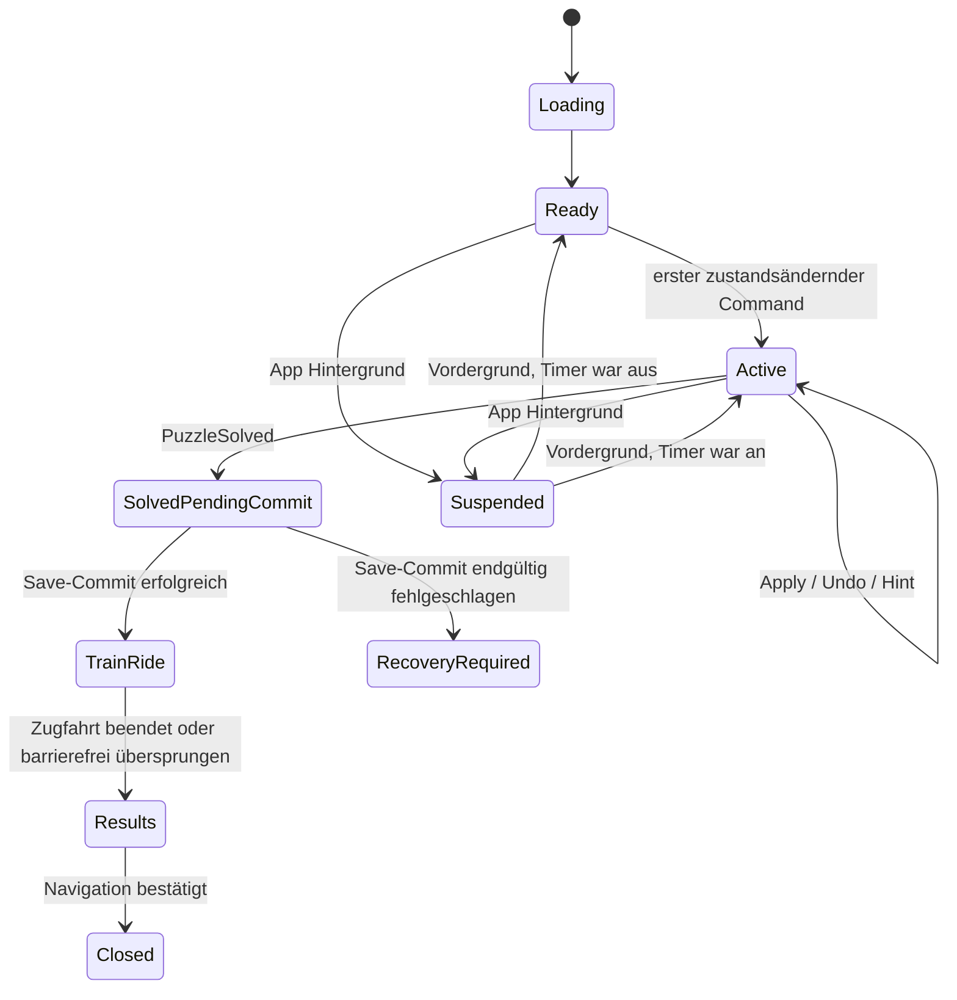

# Game State Model v0.5

## 1. Zustandsprinzip

Der fachliche Spielzustand ist ein unveränderlicher Snapshot. Commands sind die einzige Mutationsgrenze. UI-Auswahl, Animation und SDK-Verfügbarkeit sind keine Rätselwahrheit. Persistente Zustände werden versioniert; abgeleitete Read Models können jederzeit neu erzeugt werden.

## 2. Zustandsräume

| Zustandsraum | Persistiert | Eigentümer | Beispiele |
|---|---:|---|---|
| `GameProfileState` | Ja | Application | Fortschritt, Sterne, Bestzeiten, Währung, Kosmetik, Claimterminals, Entitlements, Einstellungen. |
| `PuzzleSessionState` | Ja, solange Entwurf aktiv | Puzzle Domain | Zellinhalte, Timer, Nutzung von Markierungen/Hinweisen, Undo-Diffs. |
| `PuzzleDefinition` | Nein im Save; Contentquelle | Content/Domain | Raster, A/B, Randzahlen, Regeln. |
| `PuzzleViewState` | Nein | Presentation | aktive Auswahl, Werkzeug, Fokus, Hover/Press, Animation. |
| `ServiceRuntimeState` | Nein; notwendige fachliche Operationen separat persistent | Adapter/Application | Consentcapabilities, Adload, SDK-Handle, Netzwerkhinweis. |
| `ReleaseConfiguration` | Nein; Buildartefakt | Bootstrap | Environment, IDs, Featurefähigkeiten, Build-ID. |

## 3. Zell- und Gleiszustände

`CellContent` ist ein geschlossenes Enum. Die Stringwerte sind in Level- und Saveformat identisch.

| Wert | Fachliche Bedeutung | Zählt als Gleisbelegung | Konkrete Anschlüsse |
|---|---|---:|---|
| `UNSET` | unberührt oder vollständig geleert | Nein | keine |
| `MARK_EMPTY` | rote optionale Leerannahme | Nein | keine |
| `MARK_OCCUPIED` | graue optionale Belegungsannahme | Ja für sichtbare Mengenrückmeldung, nicht für Completion | unbekannt |
| `TRACK_NS` | braune senkrechte Gerade | Ja | N, S |
| `TRACK_EW` | braune waagerechte Gerade | Ja | E, W |
| `TRACK_NE` | braune Kurve oben–rechts | Ja | N, E |
| `TRACK_ES` | braune Kurve rechts–unten | Ja | E, S |
| `TRACK_SW` | braune Kurve unten–links | Ja | S, W |
| `TRACK_WN` | braune Kurve links–oben | Ja | W, N |

Für **Completion** zählen ausschließlich die sechs `TRACK_*`-Werte. Für die objektive Zeilen-/Spaltenanzeige zählt `MARK_OCCUPIED` als vom Spieler angenommene Belegung mit, damit erfüllt/überschritten sichtbar werden kann; diese Anzeige behauptet keine Lösungsrichtigkeit. `MARK_EMPTY` und `UNSET` zählen nicht.

Gelb existiert nicht in `CellContent`. Es ist ausschließlich die Präsentation von `SelectionState` oder `ActiveToolState`.

## 4. Werkzeuge und Auswahl

| Werkzeugwert | Erzeugter Zellinhalt |
|---|---|
| `EMPTY_MARKER` | `MARK_EMPTY` |
| `OCCUPIED_MARKER` | `MARK_OCCUPIED` |
| `TRACK_NS_TOOL` bis `TRACK_WN_TOOL` | korrespondierendes `TRACK_*` |
| `CLEAR_TOOL` | `UNSET` |
| `MULTI_SELECT_MODE` | Kein Zellinhalt; ändert nur Auswahlmodus. |

`SelectionState` enthält sortierte eindeutige Koordinaten, den Auswahlmodus und den fokussierten Rasterpunkt. Eine Einzelfeldanwendung erzeugt `ApplyCellContent` auf genau eine Koordinate. Mehrfachauswahl sammelt Koordinaten transient; die bestätigte Anwendung erzeugt einen **atomaren** `ApplyCellContentBatch`-Command. Bereits identischer Inhalt ist ein No-op und erzeugt keinen Undo-Eintrag.

Die konkreten Touchgesten sind ein offenes Produktdetail. Alle Gesten müssen dieselben Commands erzeugen; ihre spätere Festlegung erfordert keine Domainänderung.

## 5. PuzzleSessionState

| Feld | Typ/Regel | Persistenz |
|---|---|---:|
| `puzzleId` | stabile fachliche Puzzle-ID | Ja |
| `publicPuzzleHash` | `{profile, sha256}` der unveränderlichen öffentlichen Fachprojektion | Ja |
| `attemptId` | lokal eindeutige UUID | Ja |
| `mode` | `FIRST_RUN`, `PRACTICE`, `REVISION`, `ENDLESS` | Ja |
| `cells` | zeilenweise Array aus `CellContent`, exakt `width * height` | Ja |
| `phase` | fachliche Sessionphase | Ja |
| `timerStarted` | wahr nach erstem zustandsänderndem Command | Ja |
| `activeElapsedMs` | monotone aktive Zeit, ganzzahlig | Ja |
| `usedEmptyMarker` | sticky true | Ja |
| `usedOccupiedMarker` | sticky true | Ja |
| `hintCount` | nicht negativ; sticky | Ja |
| `correctionCount` | Zahl echter Inhaltsänderungen nach erstmaliger Belegung | Ja |
| `undoStack` | maximal 256 atomare Diffs, älteste zuerst verwerfbar | Ja |
| `solvedEventId` | null oder deterministische Abschluss-ID | Ja |
| `startedAtUtc` | Diagnose/Day-Boundary, nicht Timerquelle | Ja |
| `lastSavedAtUtc` | Persistenzdiagnose | Ja |

Ein Entwurf wird nur bei exakt passendem Tripel `{puzzleId, publicPuzzleHash.profile, publicPuzzleHash.sha256}` geladen. Reine Dokument- oder Proofmigrationen mit identischem fachlichem Hash erhalten ihn. In einem veröffentlichten Katalog ist eine andere Semantik unter derselben Puzzle-ID `LVL-PUBLISHED-PUZZLE-MUTATED` und blockiert den Katalog; der Entwurf wird archiviert und Fortschritt nie still übertragen.

`hintCount` zählt ausschließlich in diesem Versuch tatsächlich dargestellte Hinweise. Der Anspruch auf kostenlosen, regulären oder werbebasierten Hinweis ist kein Sessionboolean. Ein persistenter `HintEntitlementState` mit Policyversion, Level-/Modusbezug, verfügbaren Credits und idempotenten Claim-IDs ist als Application-/Savevertrag reserviert. Seine finale Semantik bleibt wegen `BLOCKER-PROD-001` unveröffentlicht, bis „neues Level“ und das reguläre Hilfekontingent produktseitig präzisiert sind.

## 6. Sessionphasen

`RecoveryRequired` verhindert nicht die lokale Anzeige der gelösten Strecke, aber keine Belohnung wird als sicher verbucht dargestellt, bevor ein persistenter Commit vorliegt. Der Nutzer erhält eine klare Wiederholoption ohne Verlust des Session-Snapshots im Speicher.

## 7. Commands

| Command | Vorbedingungen | Atomare Wirkung |
|---|---|---|
| `ApplyCellContent` | Phase `Ready/Active`, Koordinate im Raster | Inhalt setzen, Flags/Timer aktualisieren, Invarianten und Completion prüfen. |
| `ApplyCellContentBatch` | Phase `Ready/Active`, 1..N eindeutige Koordinaten | Alle Änderungen oder keine; ein Undo-Diff. |
| `UndoLastAction` | Phase `Ready/Active`, Stack nicht leer | Letzten Zell-Diff zurücknehmen; Timer und sticky Meisterschaftsflags bleiben. |
| `RequestHint` | Phase `Ready/Active`, versionierte Application-Policy erlaubt einen persistenten Credit | anforderbaren sicheren Solverhint liefern; Credit und `hintCount` erst bei tatsächlich gezeigtem Hint idempotent verbuchen. Bis `BLOCKER-PROD-001` geschlossen ist nur in Tests mit Fake-Credits. |
| `PauseForLifecycle` | Ready/Active | monotone Zeit akkumulieren und Session speichern. |
| `ResumeFromLifecycle` | Suspended | neue monotone Messperiode starten, wenn Timer bereits lief. |
| `AcknowledgeTrainRide` | TrainRide, Barrierefreiheitsoption erlaubt | zur Ergebnisphase übergehen. |
| `AcknowledgeResults` | Results | Session schließen; nachfolgende Navigation darf Ad-Eligibility prüfen. |
| `AbandonAttempt` | Ready/Active/Suspended | Entwurf auf ausdrückliche Aktion entfernen; Fortschritt unverändert. |

Commands tragen `commandId` und `expectedRevision`. Ein Command mit alter Revision wird als `STALE_COMMAND` abgelehnt. Das verhindert doppelte SDK-/UI-Callbacks.

## 8. Domainereignisse

| Ereignis | Auslöser | Verbraucher |
|---|---|---|
| `CellContentChanged` | echte Einzeländerung | Presenter, Autosave-Debounce, lokales Audio. |
| `CellBatchChanged` | atomare Mehrfachänderung | Presenter, Autosave, Audio. |
| `ObjectiveViolationChanged` | nur sichtbarer objektiver Status ändert sich | Presenter. |
| `PuzzleSolved` | alle Gültigkeitsregeln erstmals erfüllt | Application Progress/Rewards. |
| `HintPresented` | sicherer Hinweis wurde wirklich angezeigt | Meisterschaft/Autosave. |
| `SessionSuspended` | Lifecyclepause | Persistenz. |
| `ProgressCommitted` | idempotenter Save erfolgreich | Zugfahrt/Ergebnis. |
| `ResultsAcknowledged` | Nutzer verlässt vollständiges Ergebnis | Navigation und Ad-Policy. |

Ereignisse sind lokale In-Process-Fakten. Sie werden nicht als dauerhaftes Event-Sourcing-Log verwendet.

## 9. Timer- und Meisterschaftsmodell

Der Rätseltimer nutzt `IClock.MonotonicNow`. Er startet mit dem ersten Command, der mindestens eine Zelle wirklich verändert. Auswahl, Screenreader-Fokus, Öffnen des Hinweisedialogs oder ein No-op starten ihn nicht. Beim Hintergrundwechsel wird die aktive Differenz akkumuliert; Hintergrundzeit zählt nicht.

`directSolved` gilt nur, wenn beim ersten erfolgreichen Abschluss `usedEmptyMarker == false`, `usedOccupiedMarker == false` und `hintCount == 0`. Undo setzt diese sticky Flags nicht zurück. Diese Regel verändert keine Sterne und keine Geduldspunkte.

Sterne werden aus der ersten erfolgreichen aktiven Zeit beziehungsweise in freigeschalteter Betriebsrevision aus einer besseren Zeit berechnet. Konkrete Schwellen kommen später als versionierte Leveldaten; fehlende Schwellen ergeben ausschließlich einen Stern und keinen Fehler.

## 10. Fortschritt und Economy

`GameProfileState` enthält pro Puzzle-ID einen `LevelProgressRecord` mit profiliertem `publicPuzzleHashAtFirstCompletion`, erstem Abschluss, besten berechtigten Zeiten je Modus, höchster Sternzahl, einmalig vergebenen Sternboni, direkter Lösung und terminalem Rewardstatus. Ein Record ist nur für dasselbe fachliche Identity-Tripel gültig. Route-, Abschnitts- und Seasonfortschritt werden deterministisch aus Levelrecords und dem release-gelockten `ICampaignCatalog` abgeleitet und beim Save als überprüfbarer Cache gehalten. Offene kosmetische Meilensteinclaims liegen als strukturierte, eligibility-validierte Reservationen im Save und nicht als flüchtiger UI-/Reducerzustand vor.

Geduldspunkte werden nicht als frei überschreibbarer Saldo geführt. Ein `LedgerCheckpoint` plus begrenztes `EconomyJournal` enthält idempotente Einträge mit `transactionId`, `reasonCode`, `amount`, `subjectId`, Katalog-/Claimbezug und UTC-Diagnosezeit. Der Saldo ist Checkpointsaldo plus Journalsumme. Deduplikationswahrheit verbleibt in terminalen Level-, Claim-, Inventory-, IAP- oder Endless-Records; Kompaktierung folgt ausschließlich dem Vertrag in `PERSISTENCE.md`.

Der release-gelockte `ICompletionCatalog` ist die Quelle für bestätigte Rewardbeträge. Der `ICosmeticsCatalog` liefert diskriminierte Erwerbsverträge. Runtime-Kauf oder -Claim verlangt `PRODUCT_APPROVED` oder ausdrücklich `FIXTURE_ONLY` im Contracttest **und** Itemstatus `ACTIVE`; `DRAFT`, `HIDDEN` und `TOMBSTONE` sind nicht neu erwerbbar. `PurchaseCosmetic` prüft Kataloghash, Ownership und Saldo; negativer Ledger-Eintrag und Inventory-Grant werden in einem Savecommit unter `cosmetic-purchase:<itemId>` geschrieben. `ClaimMilestoneCosmetic` expandiert ausschließlich gelockte Campaign-Subjects zu First-Clear-Records. `RESERVE_CLAIM` persistiert Claim-ID, Operation, Claimgeneration, Item-/Katalogidentität und Eligibility-Projektion erst nach positiver Prüfung. `COMMIT_CLAIM` darf nur exakt diese offene Reservation mit erneut passender Eligibility terminalisieren und Ownership ohne Ledgerdelta schreiben. `ALREADY_OWNED` und identische Wiederholung sind No-ops; abweichende Provenienz ist Kollision.

Für `mode: ENDLESS` ist die persistente Zustandsmaschine `ReserveEndless -> RESERVED_NOT_GENERATED -> ACTIVE_DRAFT -> COMPLETION_CLAIM_OPEN -> terminal`; Abandon führt aus Reservation oder aktivem Draft ohne Reward direkt zu terminal. Reservation erhöht den Watermark und speichert den vollständigen Descriptor, aber noch keinen erfundenen Puzzleinput. Erst validierte Generierung promotet atomar zum Draft. Complete entfernt Resume-Daten und eröffnet `LOCAL_DECISION_PENDING`. Von dort konkurrieren `SkipEndlessReward` und `ReserveEndlessRewardProvider` auf derselben Savegeneration. Skip entfernt den Record lokal ohne Reward/Provider; Providerreservation persistiert `PROVIDER_RESERVED` vor dem SDK-Aufruf. Erst lokaler Skip, `COMMITTED` oder providerbestätigtes `CLOSED_NO_REWARD` entfernt die Claimfortsetzung. Ein reservierter Ordinal ohne offenen Record ist terminal; ein fehlender allgemeiner Rewardrecord erzeugt für Endless keine neue Eligibility.

## 11. Persistente Mobile-Operationen

`POST_CLEAR_PATIENCE` besitzt pro Meldung den fachlichen Schlüssel `reward-claim:POST_CLEAR_PATIENCE:<puzzleId>`. Für Endless beginnt die Fortsetzung in `LOCAL_DECISION_PENDING`; `ReserveEndlessRewardProvider` führt zu `PROVIDER_RESERVED`, danach folgen `RECONCILIATION_REQUIRED`, `REWARD_CONFIRMED` oder `NO_REWARD_CONFIRMED`. Terminal sind lokaler Skip, `COMMITTED` oder providerbestätigtes `CLOSED_NO_REWARD`. Bei Kampagnenmeldungen kann fehlender Record verfügbar bedeuten; bei Endless ist ausschließlich die passende offene Fortsetzung berechtigend. Provider-Reward-ID und lokale Operation-ID sind Bindungs- und Auditfelder. Erst ein zur Claim-/Puzzle-/Operations-ID passendes Providerergebnis darf bestätigen. Reservation sowie später Claimterminal plus Ledgergutschrift erfolgen jeweils atomar; der Betrag stammt aus dem release-gelockten Completionkatalog und niemals aus dem Callback. Ein paralleler oder verspäteter Callback kann deshalb nie einen zweiten oder abweichenden Gegenwert erzeugen.

Eine IAP-Operation enthält `operationId`, logischen Produktkey, Store, minimale Transaktionsreferenz und genau einen Zustand aus `STARTED`, `EVIDENCE_RECEIVED`, `VERIFIED`, `GRANTED_NOT_FINALIZED`, `FINALIZED`, `REJECTED` oder `RECONCILIATION_REQUIRED`. `remove_ads` wird gemeinsam mit `GRANTED_NOT_FINALIZED` persistiert, bevor Google Acknowledge beziehungsweise Apple Finish erfolgt. Storefinalisierung und Restore verwenden denselben idempotenten Transaktionsschlüssel.

Ads-, Analytics- und Crashcapabilities sind flüchtig und starten bei jedem Prozess mit `false`. Der versionierte `PrivacyDecisionRecord` ist Input für den ConsentCoordinator; `desired`, bestätigtes `nativeSyncState` und wirksames `effective` bleiben getrennt. `ENABLE_PENDING`, `REVOKE_PENDING`, `UNKNOWN`, fehlend, defekt oder revisionsinkompatibel sind fail-closed. Ein Bootstrapfence muss vor optionaler SDK-Erfassung Native Analytics deny erzwingen. Da dieser prä-SDK-Nachweis für die gepinnte Integration fehlt, bleibt Analytics im Productionprofil ausgeschlossen; Crashlytics ist ebenfalls ausgeschlossen. Widerruf persistiert `REVOKE_PENDING` vor Native Disable und erst nach Bestätigung `REVOKED_CONFIRMED`.

## 12. Objektive Rückmeldung versus Lösungsgeheimnis

Zulässige Live-Rückmeldungen sind Zeilen-/Spaltenanzahl offen, exakt oder überschritten; konkrete Schiene führt aus Raster; konkrete Nachbaranschlüsse widersprechen sich; bereits konkrete Schienen erzeugen eine geschlossene Schleife. Diese Fakten folgen aus dem sichtbaren Stand.

Nicht zulässig sind Vergleich mit Authoring-Lösung, Markierung eines bloß später falschen X, Verraten eines noch nicht erzwungenen Gleises oder automatische Korrektur einer plausiblen Annahme. Solverwissen erreicht die UI ausschließlich nach einem ausdrücklich angeforderten Hinweis.

## 13. UI- und Servicezustand

Folgende Zustände bleiben bewusst außerhalb des Saves: aktives Tool, gelbe Zellauswahl, Scrollpositionen, geladene Werbeanzeige, offene Consentform, SDK-Initialisierungsobjekte, laufende Animationframeposition und Netzwerkstatus. Persistiert werden Nutzerpräferenzen und alle fachlich notwendigen nicht terminalen Reward-/Kauf-/Restore-/Finalisierungsoperationen mit nicht geheimen Referenzen.

## Referenzen

[1]: ../Stammstrecken_Puzzle_Konzept_00-15/03_Raetselkern_und_Interaktionsmodell.md "Train Track Spiel – Rätselkern und Interaktionsmodell"
[2]: ../Stammstrecken_Puzzle_Konzept_00-15/06_Fortschritt_Belohnungen_und_Meisterschaft.md "Stammstrecken-Puzzle – Fortschritt, Belohnungen und Meisterschaft"
[3]: ../Stammstrecken_Puzzle_Konzept_00-15/12_UI_und_Bedienungsspezifikation.md "Stammstrecken-Puzzle – UI- und Bedienungsspezifikation"
[4]: ../DECISIONS/ADR-005-deterministisches-command-state-modell.md "ADR-005 – Deterministisches Command/State-Modell"
[5]: ../DECISIONS/ADR-024-privacy-bootstrap-fence-und-widerruf.md "ADR-024 – Privacy-Bootstrap-Fence und Widerruf"
[6]: ../DECISIONS/ADR-025-endless-open-lifecycle-und-claims.md "ADR-025 – Endless-Open-Lifecycle und Claims"
[7]: ../DECISIONS/ADR-019-endless-watermark-und-save-v2.md "ADR-019 – Endless-Watermark und Save v2"
[8]: ../DECISIONS/ADR-020-privacy-lifecycle-und-sdk-grenzen.md "ADR-020 – Privacy-Lifecycle und SDK-Grenzen"
[9]: ../DECISIONS/ADR-021-puzzleidentitaet-und-proofartefakte.md "ADR-021 – Puzzleidentität und Proofartefakte"
[10]: ../DECISIONS/ADR-023-releasekandidat-und-kosmetikclaims.md "ADR-023 – Releasekandidat und Kosmetikclaims"
[11]: ../DECISIONS/ADR-027-endless-no-reward-terminalpfad.md "ADR-027 – Providerfreier Endless-No-Reward-Terminalpfad"
[12]: ../DECISIONS/ADR-028-cosmetics-reservation-binding.md "ADR-028 – Bindende Cosmetics-Claim-Reservation"
