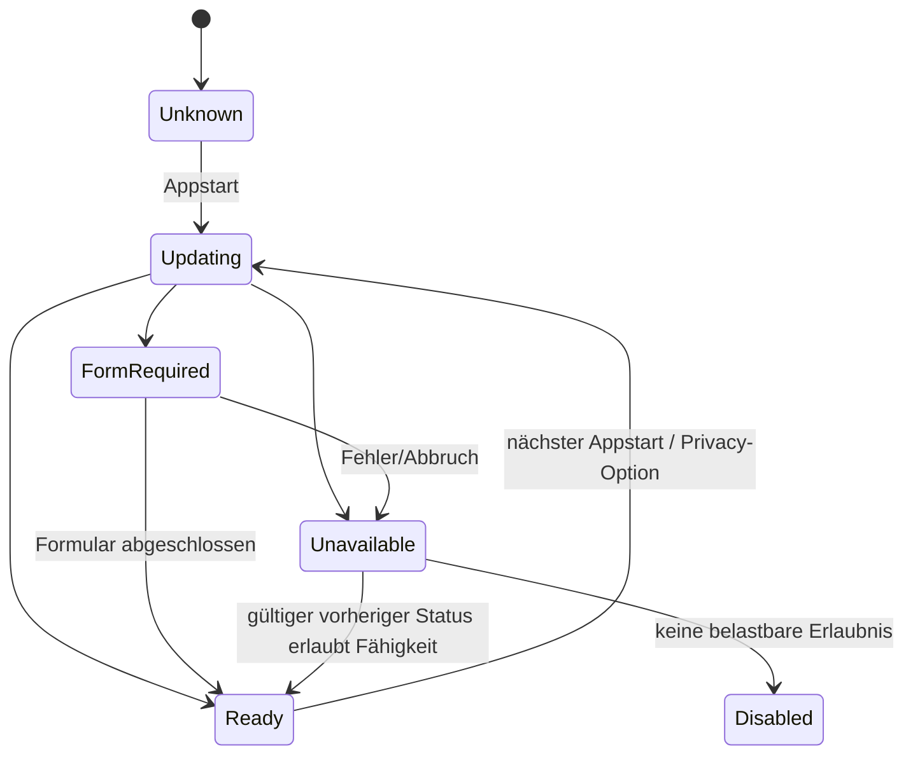
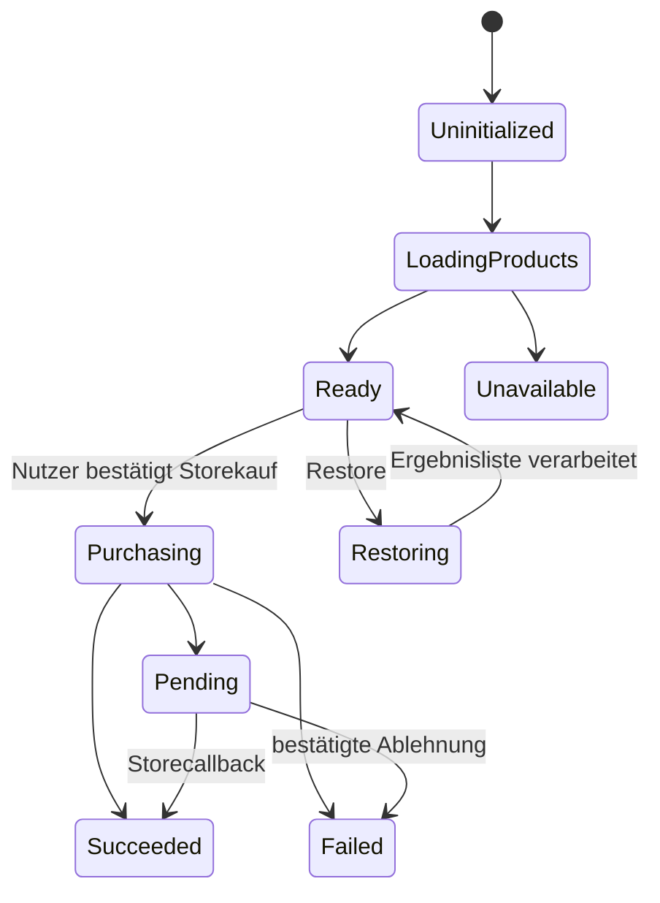

# Mobile Services v0.1

## 1. Grundregel

Mobile-Dienste sind Adapter, keine Spiellogik. Jeder Dienst kann deaktiviert, nicht initialisiert, offline, langsam oder fehlerhaft sein. In allen Fällen bleiben lokale Rätsel, Fortschritt, Zugfahrt, Kartenansicht, Betriebswerk mit bereits freigeschalteten Inhalten und Einstellungen nutzbar.

SDK-Typen, Callbacks und Exceptions enden in der Adapterassembly. Application erhält typisierte, anbieterfreie Ergebnisse. Domain und Solver kennen keine Mobile-Dienste.

## 2. Gemeinsamer Ergebnisvertrag

Jede asynchrone Operation trägt `operationId`, Cancellation und Timeout. Ergebnisstatus:

| Status | Bedeutung |
|---|---|
| `SUCCEEDED` | fachlich bestätigter Abschluss. |
| `UNAVAILABLE` | Dienst/Netz/Produkt derzeit nicht verfügbar. |
| `NOT_ALLOWED` | Consent, Entitlement oder Produktpolicy verbietet den Vorgang. |
| `CANCELLED` | Nutzer oder Lifecycle hat abgebrochen. |
| `TIMED_OUT` | kein rechtzeitiger eindeutiger Abschluss. |
| `PENDING` | Store/Dienst bestätigt asynchronen offenen Vorgang. |
| `FAILED` | endgültiger technischer Fehler mit stabilem Diagnosecode. |

Ein Timeout wird nie als Erfolg interpretiert. Späte Callbacks bleiben über `operationId` idempotent verarbeitbar.

## 3. Servicekatalog

| Port | Initialer Adapter | Sicherer Fallback |
|---|---|---|
| `IConsentPort` | UMP plus lokale Privacypräferenzen | keine Ads/Analytics; lokale App funktioniert. |
| `IAdsPort` | Google Mobile Ads 11.5.0 mit AdMob Mediation | Angebot ausblenden beziehungsweise ohne Anzeige fortfahren. |
| `IPurchasePort` | Unity IAP 5.4.3 | Kauf als nicht verfügbar zeigen; bestehender lokaler Werbefrei-Cache bleibt. |
| `IAnalyticsPort` | Firebase Analytics 13.16.0 | No-op-Sink. |
| `ICrashReportingPort` | Firebase Crashlytics 13.16.0 | begrenztes lokales Diagnosejournal. |
| `IAudioPort` | Unity AudioMixer/AudioSource | lautloser No-op ohne Spielfehler. |
| `IAppLifecyclePort` | Unity Lifecycle plus dünne native Hooks, falls nötig | konservatives Pause/Resume. |
| `INetworkStatusPort` | Plattformhinweis plus tatsächliches Requestergebnis | Status `UNKNOWN`; Dienstaufruf entscheidet selbst. |
| `IHapticsPort` | Plattformadapter | No-op. |

## 4. Consent- und Privacy-Gate

`ConsentCoordinator` aggregiert Werbeconsent, optionale Analyticspräferenz und plattformspezifische Anforderungen. UMP-Status wird bei jedem Start aktualisiert; danach wird bei Bedarf die Consentform gezeigt. Anzeigen dürfen nur angefordert werden, wenn `CanRequestAds()` wahr ist.[1]

Capabilities statt eines mehrdeutigen Gesamtbools:

- `canRequestAds`;
- `canSendAnalytics`;
- `canSendCrashReports`;
- `privacyOptionsEntryRequired`;
- `trackingAuthorizationStatus`.

Ein sichtbarer Privacy-Optionen-Einstieg erscheint in Einstellungen, wenn UMP ihn verlangt. App Tracking Transparency auf iOS wird nur angefragt, wenn eine freigegebene Konfiguration tatsächlich Tracking/IDFA nutzen soll und nachdem der Kontext verständlich erklärt wurde. Ablehnung führt zu datensparsamerem Betrieb, nicht zu Blockade.

Rechtsgrundlage, Texte, regionale Konfiguration und Store-Datendeklarationen benötigen vor Release fachliche/rechtliche Freigabe. Die Architektur rät diese Inhalte nicht.

## 5. Anzeigenpolicy

`AdPolicyService` liegt in Application. Es verarbeitet rein lokale, persistierbare Fakten und entscheidet über Eligibility. Der Google-Adapter entscheidet nur über Load/Show.

### 5.1 Harte Ausschlüsse

Unterbrechende Anzeigen sind nicht zulässig:

- beim App-Start oder vor dem ersten Rätsel;
- während `Ready`, `Active`, `Suspended`, `SolvedPendingCommit`, `TrainRide` oder Ergebnisaufbau;
- zwischen Eingabe und sichtbarer Wirkung;
- als Folge von Fehler, Korrektur, Langsamkeit, Hinweis oder Abbruch;
- wenn `remove_ads` lokal oder storeverifiziert aktiv ist;
- wenn Consent/SDK/Anzeige nicht bereit ist;
- wenn bereits eine modale Plattformoberfläche aktiv ist.

Ein Interstitial-Placement kann frühestens nach `ResultsAcknowledged` und vor einer nachfolgenden freiwillig gestarteten Navigation entstehen. Die erste Lösung ist immer frei. Nach der zweiten vollständig abgeschlossenen Standardmeldung ist die erste Anzeige möglich.

### 5.2 Frequenzalgorithmus

| Modus / Fortschritt | Mindestabstand seit letzter gezeigter Unterbrechung |
|---|---:|
| Standard, Gesamtabschluss 2 | erste mögliche Anzeige |
| Standard, Gesamtabschluss 3–8 | 2 vollständig abgeschlossene Meldungen |
| Standard, ab Gesamtabschluss 9 | 3 vollständig abgeschlossene Meldungen |
| Betriebsrevision | 5 vollständig abgeschlossene Wiederholungen |
| Dauerbaustelle | 3 vollständig abgeschlossene neue Meldungen |

Zusätzlich gilt maximal drei **tatsächlich gezeigte** Interstitials je App-Sitzung. Ein fehlgeschlagener Load/Show zählt weder als Anzeige noch als bestrafender Abstand. Die Policy speichert `lastShownEligibleOrdinal` und `sessionShownCount`; eine App-Sitzung beginnt beim Prozessstart und endet beim Prozessende, nicht beim kurzen Hintergrundwechsel.

Remote Config darf diese Obergrenzen nicht still erhöhen. Änderungen benötigen Produktentscheidung und Versionsänderung der lokalen Policy.

## 6. Rewarded Ads

Rewarded-Operationen verwenden einen Zustandsautomaten `REQUESTED -> LOADING -> SHOWING -> REWARDED | CLOSED_NO_REWARD | FAILED`. Nur der bestätigte Rewardcallback erzeugt einen Application-Command mit anbieterbezogener Reward-ID und lokaler Operation-ID.

| Placement | Voraussetzungen | Idempotenter Gegenwert |
|---|---|---|
| `POST_CLEAR_PATIENCE` | vollständiges Ergebnis, erste Lösung, je Level noch nicht beansprucht | +10 Geduldspunkte einmal je Meldung. |
| `EXTRA_HINT` | ausdrückliche Anfrage, finale `IHintPolicy` produktseitig bestätigt, Session noch aktuell | genau ein persistenter Credit für einen nicht-enttarnenden sicheren Hinweis. Wegen `BLOCKER-PROD-001` bis zur Freigabe in Production deaktiviert. |
| `DAILY_EXTRA` | bestätigte Tagespolicy, kostenloser Tageslauf verbraucht, Zusatzlauf heute nicht verbraucht | genau eine zusätzliche Teilnahme. Wegen `BLOCKER-PROD-002` bis zur Freigabe in Production deaktiviert. |

Abbruch, No Fill, Timeout oder fehlender Rewardcallback verbrauchen keinen Anspruch. Beim Hinweis wird nach Rewardbestätigung zunächst ein idempotenter Credit persistiert. Der Solver darf nur einen aus dem öffentlichen Puzzle bewiesenen Schritt wählen, der keine nicht objektiv fehlerhafte Spielerannahme enttarnt. Ist kein solcher Schritt verfügbar, bleibt der Credit bestehen. Die noch fehlende Lebensdauer- und Modussemantik aller Hintcredits ist in [`OPEN_BLOCKERS.md`](./OPEN_BLOCKERS.md) dokumentiert und wird nicht geraten.

## 7. In-App-Kauf und Restore

Der Produktkatalog enthält in v0.1 genau den logischen Schlüssel `remove_ads` als **non-consumable**. Plattformprodukt-IDs liegen je Environment in Konfiguration und werden nicht in Application hart codiert.

Application vergibt `remove_ads` ausschließlich aus einem bestätigten Purchase-/Restore-Ergebnis und einer idempotenten Transaktionsreferenz. `PENDING` zeigt keinen Erfolg und darf wiederaufgenommen werden. Doppelte, späte und nach Reinstall wiederkehrende Callbacks sind No-ops nach erfolgreichem Ledger-/Entitlementcommit.

Auf iOS existiert ein sichtbarer „Käufe wiederherstellen“-Button, wie Apple für restorable purchases verlangt.[2] Restore ist auch auf Android verfügbar. Ein transienter Fehler aktiviert Interstitials bei einem zuvor bestätigten lokalen Anspruch nicht wieder.

Der endgültige Preis ist eine offene Produktentscheidung und nicht Teil dieser Architektur.

## 8. Analyticsport

Analytics akzeptiert ausschließlich Events aus einer versionierten Allowlist in [`OBSERVABILITY.md`](./OBSERVABILITY.md). Vor Freigabe puffert Application keine personenbezogenen Events. Ohne Fähigkeit ist der Port ein No-op. Anbieterautomatik, Ad-Personalisierung und unnötige automatische Screenmessung werden deaktiviert, soweit das SDK dies unterstützt.

Analytics beeinflusst niemals Sterne, Adsfrequenz, Contentfreigabe oder lokale Währung. Eventversand erfolgt best effort und blockiert keine UI.

## 9. Crashdiagnose

Crashlytics wird über `ICrashReportingPort` initialisiert. Releasebuilds laden IL2CPP-Symbole hoch. Zulässige Crashkeys sind Build-ID, Appversion, Plattform, Save-Schema, Contenthash, Level-ID, Sessionphase und letzter Command-Code. Unzulässig sind Zellraster, Lösungsweg, Receipt, Werbe-ID, Nutzerfreitext und vollständige Dateipfade.

Wenn Remote-Crashberichte nicht erlaubt oder nicht verfügbar sind, bleibt das lokale, begrenzte Journal. Ein Testcrash in interner QA ist Release-Gate; Testcrashcode darf Production nicht erreichen.

## 10. Audio und Haptik

Application sendet semantische Cues wie `CELL_MARKED`, `TRACK_PLACED`, `UNDO`, `OBJECTIVE_EXCEEDED`, `PUZZLE_SOLVED`, `TRAIN_DEPARTURE` und `REWARD_COMMITTED`. Der Audioadapter mappt Cues auf Addressable-Clips und AudioMixergruppen. Er gibt kein Richtigkeitsurteil für plausible Eingaben.

Beim Hintergrundwechsel werden Musik/Ambience pausiert und aktive Zugfahrtpositionen in Presentation gehalten. Eingehende Audio-Cues sind deduplizierbar über Ereignis-ID. Haptik besitzt eigene Nutzerpräferenz und ist niemals Voraussetzung für Information.

## 11. Plattform- und Lifecycle-Abstraktion

| Ereignis | Verbindliche Reaktion |
|---|---|
| Fokusverlust / Pause | Timer stoppen, sofortigen Save anfordern, Audio pausieren, laufende modale SDK-Operation markieren. |
| Resume | Savegeneration prüfen, Timer nur bei vorher aktivem Versuch weiterführen, Consentstatus gegebenenfalls aktualisieren. |
| Low Memory | nicht aktive Addressables freigeben, lokale Truth nicht verwerfen. |
| Deep Link / Storecallback | erst nach Bootstrap in typisierten Command umwandeln; Operation-ID prüfen. |
| Netzwerkwechsel | keine automatische Werbung starten; nur Verfügbarkeit neu bewerten. |
| Safe Area / Rotation | Presentation neu layouten; Domainstate unverändert. |
| Audio interruption | Audioadapter pausiert/resumiert nach Plattformkonvention. |

`Application.internetReachability` ist nur ein Hinweis. Erfolg oder Fehler wird aus dem tatsächlichen SDK-/Netzwerkaufruf abgeleitet.

## 12. Providerwechsel

Ein anderer Anbieter implementiert dieselben Contracttests. Ein Wechsel ändert weder Applicationpolicy noch Domain, benötigt aber wegen Datenfluss, SDK, Build und Releasefähigkeit ein ersetzendes ADR. Zwei aktive Anbieter für dieselbe Fähigkeit sind ohne Migrationsplan verboten.

## 13. Testmatrix

Pflichtfälle sind Consent erforderlich/nicht erforderlich/abgelehnt/Fehler/Änderung, Appstart offline, Ad No Fill, Loadtimeout, Showabbruch, Rewardcallback vor/nach Close, doppelter Reward, unterbrochener Kauf, Pending, Duplikat, Restore, lokaler Owned-Cache, bestätigte Revokation, Hintergrund während jeder Operation, Main-Thread-Marshalling und deaktivierte Provider.

## Referenzen

[1]: https://developers.google.com/admob/unity/privacy "Set up UMP SDK for Unity"
[2]: https://developer.apple.com/documentation/storekit/restoring-purchased-products "Restoring purchased products"
[3]: ../DECISIONS/ADR-008-mobile-service-ports-und-provider.md "ADR-008 – Mobile-Service-Ports mit Google- und Unity-Adaptern"
[4]: ../Stammstrecken_Puzzle_Konzept_00-15/08_Faire_Monetarisierung_und_Werbeangebote.md "Stammstrecken-Puzzle – Faire Monetarisierung und Werbeangebote"
