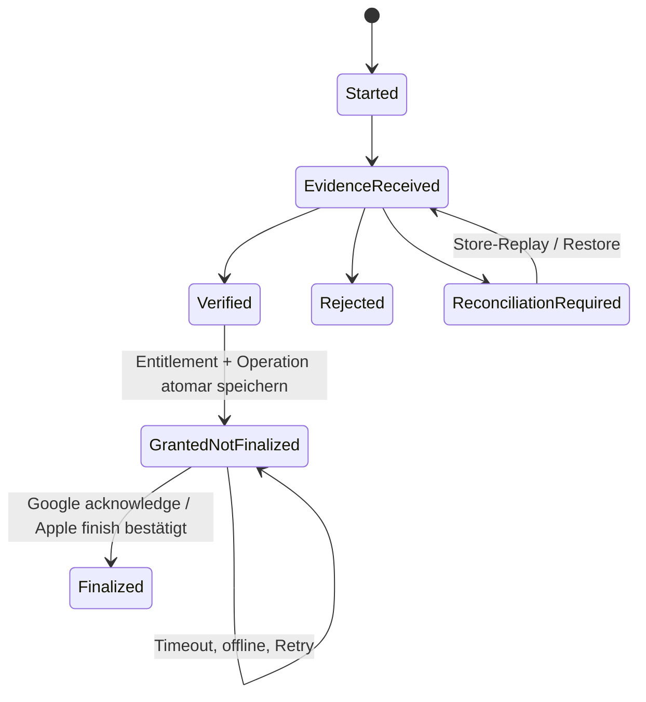

# Mobile Services v0.3

## 1. Grundregel

Mobile-Dienste sind Adapter, keine Spiellogik. Jeder Dienst kann deaktiviert, nicht initialisiert, offline, langsam oder fehlerhaft sein. Lokale Rätsel, Fortschritt, Zugfahrt, Karte, bereits freigeschaltete Kosmetik und Einstellungen bleiben nutzbar.

Providerneutrale Ports, Ergebnisunionen und Operationstypen liegen in `STP.Application`. SDK-Typen, Callbacks und Exceptions enden in der jeweiligen Adapterassembly. Domain und Solver kennen keine Mobile-Dienste.

## 2. Gemeinsamer Ergebnisvertrag

Jede asynchrone Operation trägt eine lokal erzeugte `operationId`, Cancellation und Timeout. Ergebnisstatus:

| Status | Bedeutung |
|---|---|
| `SUCCEEDED` | fachlich bestätigter Abschluss. |
| `UNAVAILABLE` | Dienst, Netz oder Produkt derzeit nicht verfügbar. |
| `NOT_ALLOWED` | Consent, Entitlement oder Produktpolicy verbietet den Vorgang. |
| `CANCELLED` | Nutzer oder Lifecycle hat abgebrochen. |
| `TIMED_OUT` | kein rechtzeitiger eindeutiger Abschluss. |
| `PENDING` | Store/Dienst bestätigt einen offenen Vorgang. |
| `FAILED` | endgültiger technischer Fehler mit stabilem Diagnosecode. |

Timeout ist nie Erfolg. Späte und doppelte Callbacks werden über Operation-ID und fachlichen Claim-/Transaktionsschlüssel idempotent verarbeitet.

## 3. Servicekatalog

| Application-Port | Implementierung | Sicherer Fallback |
|---|---|---|
| `IConsentPort` | `STP.MobileServices.Google`: UMP plus lokale Privacypräferenzen | keine Ads/Analytics/Crashreports; lokale App funktioniert. |
| `IAdsPort` | `STP.MobileServices.Google`: Google Mobile Ads 11.5.0 mit AdMob Mediation | Angebot ausblenden beziehungsweise ohne Anzeige fortfahren. |
| `IPurchasePort` | `STP.MobileServices.Store`: Unity IAP 5.4.3 | Kauf nicht verfügbar; bestätigter lokaler Werbefrei-Cache bleibt. |
| `IAnalyticsPort` | `STP.MobileServices.Google`: Firebase Analytics 13.16.0 | No-op-Sink. |
| `ICrashReportingPort` | Production: lokaler redigierter Diagnosesink; Firebase Crashlytics 13.16.0 ist ausgeschlossen. | begrenztes lokales Diagnosejournal. |
| `IAudioPort` | `STP.Audio`: AudioMixer/AudioSource | lautloser No-op ohne Spielfehler. |
| `IAppLifecyclePort` | `STP.Platform`: Unity Lifecycle plus notwendige dünne Hooks | konservatives Pause/Resume. |
| `INetworkStatusPort` | `STP.Platform`: Plattformhinweis plus tatsächliches Ergebnis | `UNKNOWN`; Dienstaufruf entscheidet selbst. |
| `IHapticsPort` | `STP.Platform` | No-op. |

Es gibt keine `STP.MobileServices.Contracts`-Assembly und keinen `ISaveSyncPort`.

## 4. Privacy Decision Record und Capability Gate

Capabilities sind getrennt. Das Application-Capabilityobjekt beginnt bei jedem Prozess mit `false`:

- `canRequestAds`;
- `canSendAnalytics`;
- `canSendCrashReports`;
- `privacyOptionsEntryRequired`;
- `trackingAuthorizationStatus`.

Der persistente `PrivacyDecisionRecord` enthält ausschließlich `recordVersion`, `policyRevision`, `sdkContractRevision`, `decisionRevision`, `capturedAtUtc`, getrennte Ads-/Analytics-/Crashentscheidungen, `validity` und `source`. UMP-Strings, Advertising IDs und Personenkennungen werden nicht übernommen. Fehlend, defekt, unbekannt oder revisionsinkompatibel ergibt `INVALID` und alle Capabilities `false`.

`desiredCapabilities` aus einem validen Record und `effectiveCapabilities` nach erfolgreich angewandten nativen Effekten sind getrennt. Ein fehlgeschlagener oder abgebrochener Effekt bleibt `false`. Eine kompatible, integre Entscheidung darf Analytics offline weitergelten; Ads benötigen dennoch ein aktuelles UMP-`Update()` des Starts. Crash bleibt im Productionprofil immer `false`.

Startreihenfolge: (1) Application effective alles `false`; (2) Record laden und Revisionen prüfen; (3) invalid oder Upgrade: Analytics nativ `false`, keine Ads/IAP/Crash-Initialisierung; (4) UMP online aktualisieren und erforderliche Form zeigen; (5) aktuellen Record atomar persistieren; (6) zugelassene native Effekte anwenden; (7) erst danach den jeweiligen Port effective schalten.

UMP-Status wird bei jedem Start aktualisiert. Nur der dafür notwendige Consentstatus-/Formfluss darf vor Adfreigabe kommunizieren. Anzeigen dürfen erst nach `CanRequestAds() == true` initialisiert beziehungsweise geladen werden.[1] App Tracking Transparency wird nur bei einer rechtlich und produktseitig freigegebenen Trackingkonfiguration angefragt. Ablehnung blockiert das Spiel nicht.

## 5. Build- und native Default-Off-Matrix

Application-No-ops allein genügen nicht. Productionbuild, native Konfiguration, Dashboard und Initialisierungsreihenfolge müssen Sammlung vor Freigabe verhindern.

| System | Build-/native Default-Off | Runtime-Aktivierung | Ohne Consent / offline | Releasenachweis |
|---|---|---|---|---|
| Unity-/Developer Data | Unity Analytics, Cloud Diagnostics und nicht benötigte Unity-Gaming-Services-Pakete fehlen aus `manifest.json`; Unity-Services-Autoinitialisierung und Editor-/Runtime-Analytics sind deaktiviert. | Nur eine später ausdrücklich freigegebene Fähigkeit darf ein benötigtes Unity-Service-Modul initialisieren. | Keine optionale Übertragung oder eigene Vor-Consent-Eventqueue. | Paket-/Native-Manifest-Scan und Netzwerkmitschnitt. |
| Unity IAP 5.4.3 | Keine IAP-Initialisierung im Bootstrap; Storeproduktabfrage startet erst nach sichtbarer Kauf-/Restoreaktion oder bei persistenter Recovery. Das Inventar führt die immer erhobenen Daten und Unity-Authentication-Abhängigkeit auf.[5] | Nutzeraktion oder Recovery **und** freigegebener `IapPrivacyReadiness`-Beleg. | Ohne Readiness `NOT_ALLOWED`; bestätigter lokaler `remove_ads`-Cache bleibt. | Privacy-/SDK-Inventar, Dashboard-/Storedeklarationen, Sandboxflow und separater Capture. |
| Firebase Analytics 13.16.0 | Android: `firebase_analytics_collection_enabled=false`, `google_analytics_adid_collection_enabled=false`, Personalisierung aus. iOS: `FIREBASE_ANALYTICS_COLLECTION_ENABLED=NO`, kein AdSupport/IDFA, Personalisierung aus.[6][7] | Nach gültigem Record erst Privacy-/Personalisierungssignale, dann `SetAnalyticsCollectionEnabled(true)`. | Ohne gültigen Record Override `false`; keine Application-Vorfreigabequeue. | Native-Konfigurationsscan, DebugView und Capture. |
| Analytics Reset-only-Build | Zusätzlich `firebase_analytics_collection_deactivated=true` beziehungsweise `FIREBASE_ANALYTICS_COLLECTION_DEACTIVATED=YES`; beim Start Runtime-Override `false` schreiben. | In diesem Binary niemals aktivierbar. Erst ein späterer kompatibler Build entfernt den permanenten Schalter; der persistierte Override bleibt `false` bis zum neuen Entscheid. | Verhindert, dass ein früher persistiertes `true` beim invalidierenden Upgrade gewinnt. | Upgradecapture mit zuvor aktivem Testbuild und Native-Config-Hash. |
| Firebase Crashlytics 13.16.0 | **Nicht im Productionprofil enthalten.** Der Anbieter dokumentiert, dass `false` erst beim nächsten Start gilt und lokal gesammelte Berichte beim späteren Aktivieren gesendet werden.[8][9] | Keine Production-Aktivierung; `canSendCrashReports` bleibt `false`. | Lokaler redigierter Diagnosering. | Paket-/Linker-/Native-Manifest-Scan bestätigt Abwesenheit. |
| Google Mobile Ads | Keine Ads-SDK-Initialisierung und kein Adload vor `CanRequestAds`; Test-/Production-App-IDs profilgetrennt. | Erst nach `canRequestAds == true`; UMP separat davor zulässig. | Keine Anzeige, kein Load, kein Retry. | Manifestscan, UMP-/Ad-Test und Capture. |

Wenn ein SDK zwingende Developer Data überträgt, die technisch nicht deaktivierbar ist, müssen Datenart, Zweck, Endpoint, Aufbewahrung, Anbieterrolle, Storedeklaration und Rechtsgrundlage vor Production im SDK-/Privacy-Inventar freigegeben sein. Unity IAP 5.4 fällt ausdrücklich in diese Kategorie und hat keinen eigenen Consentdienst.[5] Bis zu dieser Freigabe darf es nicht initialisieren. Notwendige Apple-/Google-Storekommunikation nach ausdrücklicher Kauf-/Restoreaktion ist kein Analytics-Opt-in, bleibt aber datensparsam, dokumentiert und zweckgebunden.

Providerdashboards deaktivieren automatische Signals/Personalization, Datenverknüpfung und nicht benötigte Exporte soweit verfügbar. Der Releasebeleg enthält exportierte beziehungsweise manuell gegenkontrollierte Einstellungen; Dashboardzustand wird nicht nur behauptet.

## 6. Anzeigenpolicy

`AdPolicyService` liegt in Application. Der Adapter entscheidet nur über Load/Show.

Unterbrechende Anzeigen sind ausgeschlossen:

- beim App-Start oder vor dem ersten Rätsel;
- während `Ready`, `Active`, `Suspended`, `SolvedPendingCommit`, `TrainRide` oder Ergebnisaufbau;
- zwischen Eingabe und sichtbarer Wirkung;
- als Folge von Fehler, Korrektur, Langsamkeit, Hinweis oder Abbruch;
- bei aktivem `remove_ads`;
- wenn Consent, SDK oder Anzeige nicht bereit ist;
- während einer anderen modalen Plattformoberfläche.

Ein Interstitial kann frühestens nach `ResultsAcknowledged` und vor nachfolgender freiwilliger Navigation entstehen. Die erste Lösung ist frei; nach der zweiten vollständig abgeschlossenen Standardmeldung ist die erste Anzeige möglich.

| Modus / Fortschritt | Mindestabstand seit letzter gezeigter Unterbrechung |
|---|---:|
| Standard, Gesamtabschluss 2 | erste mögliche Anzeige |
| Standard, Gesamtabschluss 3–8 | 2 vollständig abgeschlossene Meldungen |
| Standard, ab Gesamtabschluss 9 | 3 vollständig abgeschlossene Meldungen |
| Betriebsrevision | 5 vollständig abgeschlossene Wiederholungen |
| Dauerbaustelle | 3 vollständig abgeschlossene neue Meldungen |

Maximal drei tatsächlich gezeigte Interstitials je Prozesssitzung. Load-/Showfehler zählen nicht. Remote Config darf Obergrenzen nicht erhöhen.

## 7. Rewarded Ads und einmaliger Claim

Der Adapterzustand lautet `REQUESTED -> LOADING -> SHOWING -> REWARDED | CLOSED_NO_REWARD | FAILED`. Ein Rewardcallback erzeugt nur ein providerneutrales Application-Ergebnis mit lokaler Operation-ID und Audit-Provider-ID.

| Placement | Fachlicher Claim | Gegenwert |
|---|---|---|
| `POST_CLEAR_PATIENCE` | `reward-claim:POST_CLEAR_PATIENCE:<puzzleId>` | +10 Geduldspunkte exakt einmal je Meldung. |
| `EXTRA_HINT` | erst nach bestätigter `IHintPolicy` | ein persistenter Hintcredit; wegen `BLOCKER-PROD-001` Production-aus. |
| `DAILY_EXTRA` | erst nach bestätigter Tagespolicy | eine zusätzliche Teilnahme; wegen `BLOCKER-PROD-002` Production-aus. |

Vor Adload führt Application Eligibilityprüfung und persistente `RESERVED`-Reservation in einem atomaren Savecommit aus. Nur eine Operation kann eine Claim-ID reservieren. Provider-/Operation-ID ist kein fachlicher Deduplikationsschlüssel.

Nur `REWARDED` derselben Reservation darf in **einem** Savecommit Claim `COMMITTED` setzen und den Ledger-Eintrag erzeugen. Parallelität wird über Savegeneration abgewiesen. Terminal ohne Reward gibt die Reservation atomar frei. Crash, Timeout oder unbekannter Showausgang führt zu `RECONCILIATION_REQUIRED`; bis zu einer eindeutigen Adapterantwort bleibt der Claim gesperrt und eine zweite Anzeige verboten. Ein später identischer Callback ist No-op nach Commit. Ein Callback einer bereits freigegebenen älteren Operation wird quarantänisiert und niemals automatisch als zweiter Reward verbucht.

Beim Hint bleibt ein bestätigter Credit bestehen, wenn kein nicht enttarnender sicherer Hinweis lieferbar ist. Die offene Lebensdauer-/Modussemantik bleibt in `OPEN_BLOCKERS.md` unverändert.

## 8. Clientseitiger IAP-Trustvertrag

Der Produktkatalog enthält genau `remove_ads` als Non-Consumable. Plattformprodukt-IDs liegen je Environment in Buildkonfiguration. Es wird kein Backend eingeführt.

### 8.1 Verifikation

Ein Kauf- oder Restorebeleg gilt nur als `VERIFIED`, wenn der Storeadapter die plattformspezifische signierte Transaktion beziehungsweise Receipt-/Tokenantwort lokal mit den offiziellen Store-/Unity-IAP-Mechanismen validiert. Geprüft werden mindestens:

- logischer Produktkey und konfigurierte Plattformprodukt-ID;
- Bundle-/Package-ID und Storeenvironment;
- Transaktions-/Purchase-Token-Referenz;
- Kaufstatus und, soweit verfügbar, Signatur-/Receiptkette;
- Übereinstimmung mit dem erwarteten Non-Consumable.

Rohreceipt, Token und Credentials werden weder geloggt noch in Analytics geschrieben. Die Architektur beansprucht keinen serverseitigen Fraudschutz; sie schützt Korrektheit, Crash-Recovery und idempotenten Grant im bestätigten client-only Umfang.

### 8.2 Persistente Zustandsmaschine und Reihenfolge

1. Belegreferenz als `EVIDENCE_RECEIVED` persistieren.
2. Beleg lokal prüfen.
3. Entitlement `remove_ads` und `GRANTED_NOT_FINALIZED` atomar persistieren.
4. **Erst danach** Google Purchase acknowledge beziehungsweise Apple Transaction finish auslösen.
5. Storeerfolg als `FINALIZED` persistieren.

Ein Crash vor Schritt 3 wird über Store-Replay/Restore erneut validiert. Ein Crash zwischen 3 und 5 wiederholt nur Finalisierung, nicht Grant. Ein Crash nach Storeerfolg, aber vor lokalem `FINALIZED`, wird durch Produkt-/Ownershipabfrage abgeglichen. Retry verwendet denselben Transaktionsschlüssel und die in `PERSISTENCE.md` definierte gedeckelte Backofffolge.

Restore auf iOS und Android verwendet dieselbe Pipeline. Eine leere, fehlgeschlagene oder zeitüberschrittene Abfrage widerruft keinen bestätigten lokalen Anspruch. Nur eine eindeutige verifizierte Refund-/Revocationaussage setzt `REVOCATION_CONFIRMED`. Widersprüchliche Storeantworten werden `RECONCILIATION_REQUIRED`; der zuvor bestätigte Werbefreistatus bleibt konservativ aktiv.

## 9. Widerruf, Re-enable, Restart und Offline

**Widerruf:** Zuerst wird `REVOKED` atomar lokal gespeichert. Danach werden effektive Ports sofort No-op, Ads verworfen und Analytics Override `false` gesetzt. Schlägt der native Effekt fehl, bleibt Application trotzdem gesperrt und wiederholt Disable beim nächsten Start; kein Ereignis wird gepuffert.

**Re-enable:** Nur nach erfolgreichem UMP-Update/Form und atomar gespeichertem, revisionsaktuellem `VALID`-Record. Für Analytics werden zuerst Privacy-/Personalisierungssignale gesetzt, dann Collection aktiviert und erst nach Erfolg `effective=true`. Ads werden separat nur bei `CanRequestAds()==true` initialisiert. Crash bleibt ausgeschlossen; IAP bleibt bis sichtbarer Aktion/Recovery und Readiness aus.

**Restart:** Jeder Start beginnt effective false und synchronisiert gegen den lokalen Record. Ein persistierter Provideroverride ist niemals selbst die Entscheidwahrheit. **Offline:** kompatibles Analytics-Opt-in kann nach NativeApply gelten; Ads bleiben ohne aktuelles UMP-Update aus. Invalidierung oder unbekannter Zustand bleibt vollständig fail-closed.

## 10. Reproduzierbare Privacy-Gerätetests

Vor RC-Promotion werden auf **jeder Plattform** vier getrennte Szenarien auf physischen Geräten oder einer freigegebenen physischen Device-Farm ausgeführt. Emulator und Simulator erfüllen das Gate niemals allein:

Der Testvertrag lautet:

1. **Fresh Install:** Daten löschen; vor Entscheidung nur UMP-Flow, keine Ads-/Analytics-/Crash-/IAP-Kommunikation.
2. **Upgrade prior active:** Testvorversion mit Analytics-Override `true`, danach Reset-only-RC installieren; vor Re-Consent kein Analyticskontakt, Runtimewert wird `false`.
3. **Revocation:** Analytics und Ads gezielt aktivieren, widerrufen und noch im selben Prozess sowie nach Restart keine weiteren Requests beobachten.
4. **Re-enable:** Re-enable-fähigen späteren Build nach validem aktuellen Entscheid prüfen; nur freigegebene Analytics-/Adsachsen senden, Crash bleibt abwesend.

Jedes Szenario läuft online und, wo sinnvoll, offline. DNS-/SNI-Kontakt zählt als Traffic. IAP-Kommunikation ist nur in einem getrennten Readiness-/Kauf-/Restoreflow zulässig.

Der Beleg enthält Plattform, physisches Gerätemodell/-ID-Pseudonym, OS, Build-/Artefakthash, native Konfigurationshashes, Zeitfenster, Capturetoolversion, Capturehash, Endpointklassifikation und Reviewer. Ein nicht entschlüsselbarer, aber sichtbarer DNS-/SNI-Zielkontakt zählt als Übertragung und muss klassifiziert werden. Unerklärter Traffic blockiert die Freigabe.

## 11. Audio, Haptik und Lifecycle

Application sendet semantische Cues. Audio/Haptik geben kein Richtigkeitsurteil für plausible Eingaben. Fokusverlust stoppt Timer, fordert Save an, pausiert Audio und markiert modale SDK-Operationen. Resume prüft Savegeneration und persistente Mobile-Operationen. Netzwerkwechsel startet keine Werbung automatisch.

## 12. Providerwechsel und Tests

Ein anderer Anbieter implementiert dieselben Contracttests. Ein Wechsel benötigt wegen Datenfluss, SDK und Releasefähigkeit ein ersetzendes ADR. Zwei aktive Anbieter für dieselbe Fähigkeit sind ohne Migrationsplan verboten.

Pflichtfälle sind Consent erforderlich/nicht erforderlich/abgelehnt/Fehler/Widerruf, Recordrevision, desired/effective-Trennung, native Default-Off-/Crash-Exclusion-Scan, Fresh-Install-/Upgrade-/Widerruf-/Re-enable-Capture, Appstart offline, Ad No Fill, Rewardreservation, Parallelität, Spätcallback, Crash an jeder Claimphase, Kaufbeleg gültig/ungültig/unklar, Crash an jeder IAP-Phase, Google Acknowledge, Apple Finish, Retry, Restore, widersprüchliche Storeantwort, Revocation, Hauptthread-Marshalling und deaktivierte Provider.

## Referenzen

[1]: https://developers.google.com/admob/unity/privacy "Set up UMP SDK for Unity"
[2]: https://developer.apple.com/documentation/storekit/restoring-purchased-products "Restoring purchased products"
[3]: ../DECISIONS/ADR-020-privacy-lifecycle-und-sdk-grenzen.md "ADR-020 – Privacy-Lifecycle und SDK-Grenzen"
[4]: ./PERSISTENCE.md "Persistence v0.3"
[5]: https://docs.unity.com/en-us/iap/privacy-and-consent/overview "Unity IAP 5.4 Privacy overview"
[6]: https://firebase.google.com/docs/analytics/android/configure-data-collection "Firebase Analytics Android data collection"
[7]: https://firebase.google.com/docs/analytics/ios/configure-data-collection "Firebase Analytics Apple data collection"
[8]: https://firebase.google.com/docs/crashlytics/android/customize-crash-reports "Firebase Crashlytics Android opt-in reporting"
[9]: https://firebase.google.com/docs/crashlytics/ios/customize-crash-reports "Firebase Crashlytics Apple opt-in reporting"
[10]: https://firebase.google.com/support/release-notes/unity "Firebase Unity SDK 13.16.0 Release Notes"
[11]: https://github.com/googleads/googleads-mobile-unity/releases/tag/v11.5.0 "Google Mobile Ads Unity Plugin 11.5.0"
