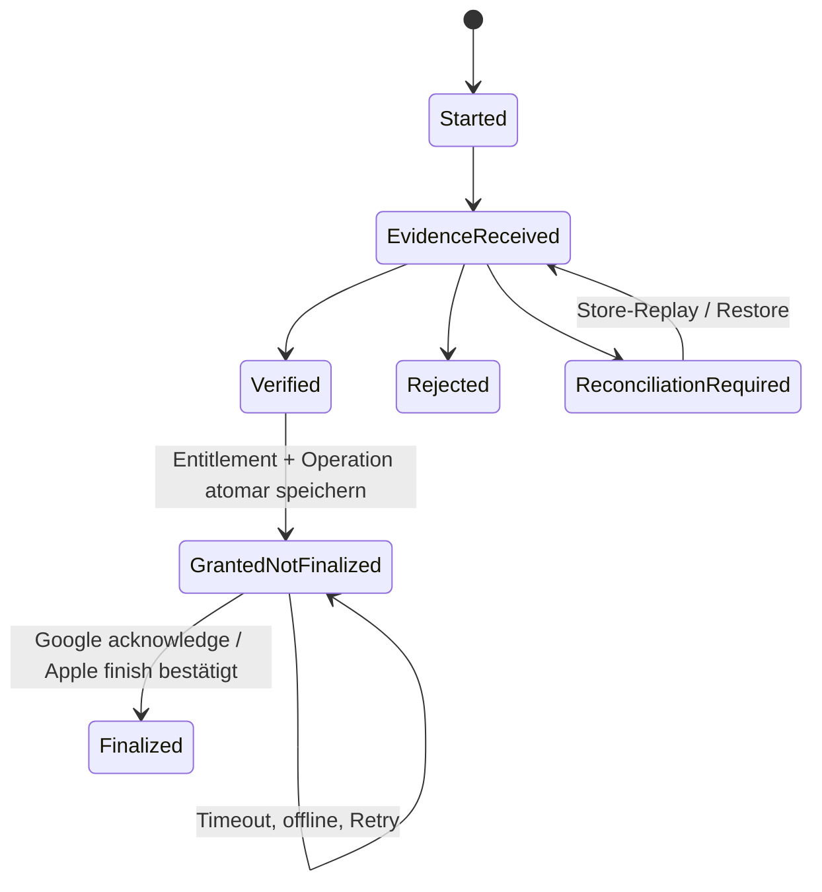

# Mobile Services v0.2

## 1. Grundregel

Mobile-Dienste sind Adapter, keine Spiellogik. Jeder Dienst kann deaktiviert, nicht initialisiert, offline, langsam oder fehlerhaft sein. Lokale Rätsel, Fortschritt, Zugfahrt, Karte, bereits freigeschaltete Kosmetik und Einstellungen bleiben nutzbar.

Providerneutrale Ports, Ergebnisunionen und Operationstypen liegen in `STP.Application`. SDK-Typen, Callbacks und Exceptions enden in der jeweiligen Adapterassembly. Domain und Solver kennen keine Mobile-Dienste.

## 2. Gemeinsamer Ergebnisvertrag

Jede asynchrone Operation trägt eine lokal erzeugte `operationId`, Cancellation und Timeout. Ergebnisstatus:

| Status | Bedeutung |
|---|---|
| `SUCCEEDED` | fachlich bestätigter Abschluss. |
| `UNAVAILABLE` | Dienst, Netz oder Produkt derzeit nicht verfügbar. |
| `NOT_ALLOWED` | Consent, Entitlement oder Produktpolicy verbietet den Vorgang. |
| `CANCELLED` | Nutzer oder Lifecycle hat abgebrochen. |
| `TIMED_OUT` | kein rechtzeitiger eindeutiger Abschluss. |
| `PENDING` | Store/Dienst bestätigt einen offenen Vorgang. |
| `FAILED` | endgültiger technischer Fehler mit stabilem Diagnosecode. |

Timeout ist nie Erfolg. Späte und doppelte Callbacks werden über Operation-ID und fachlichen Claim-/Transaktionsschlüssel idempotent verarbeitet.

## 3. Servicekatalog

| Application-Port | Implementierung | Sicherer Fallback |
|---|---|---|
| `IConsentPort` | `STP.MobileServices.Google`: UMP plus lokale Privacypräferenzen | keine Ads/Analytics/Crashreports; lokale App funktioniert. |
| `IAdsPort` | `STP.MobileServices.Google`: Google Mobile Ads 11.5.0 mit AdMob Mediation | Angebot ausblenden beziehungsweise ohne Anzeige fortfahren. |
| `IPurchasePort` | `STP.MobileServices.Store`: Unity IAP 5.4.3 | Kauf nicht verfügbar; bestätigter lokaler Werbefrei-Cache bleibt. |
| `IAnalyticsPort` | `STP.MobileServices.Google`: Firebase Analytics 13.16.0 | No-op-Sink. |
| `ICrashReportingPort` | `STP.MobileServices.Google`: Firebase Crashlytics 13.16.0 | begrenztes lokales Diagnosejournal. |
| `IAudioPort` | `STP.Audio`: AudioMixer/AudioSource | lautloser No-op ohne Spielfehler. |
| `IAppLifecyclePort` | `STP.Platform`: Unity Lifecycle plus notwendige dünne Hooks | konservatives Pause/Resume. |
| `INetworkStatusPort` | `STP.Platform`: Plattformhinweis plus tatsächliches Ergebnis | `UNKNOWN`; Dienstaufruf entscheidet selbst. |
| `IHapticsPort` | `STP.Platform` | No-op. |

Es gibt keine `STP.MobileServices.Contracts`-Assembly und keinen `ISaveSyncPort`.

## 4. Privacy Capability Gate

Capabilities sind getrennt. Das Application-Capabilityobjekt beginnt bei jedem Prozess mit `false`; ein nativer persistenter SDK-Override darf nur dann bereits `true` sein, wenn er denselben noch gültigen lokalen Entscheid spiegelt:

- `canRequestAds`;
- `canSendAnalytics`;
- `canSendCrashReports`;
- `privacyOptionsEntryRequired`;
- `trackingAuthorizationStatus`.

`UNKNOWN`, fehlender lokaler Entscheid, Formfehler, Abbruch oder nicht geladene Konfiguration kann keine Fähigkeit auf `true` setzen. Eine bereits explizit persistierte und für die aktuelle Privacy-/Policyversion gültige Entscheidung darf offline weitergelten; ein Netzwerkfehler allein widerruft sie nicht. Eine Fähigkeit wird nur durch diesen gültigen Entscheid plus erfolgreiche Runtime-Aktivierung freigegeben. Ein Widerruf setzt den Application-Port sofort auf No-op und den nativen SDK-Override auf `false`. SDK-spezifische lokale Puffer werden nach den Regeln in Abschnitt 5 behandelt.

UMP-Status wird bei jedem Start aktualisiert. Nur der dafür notwendige Consentstatus-/Formfluss darf vor Adfreigabe kommunizieren. Anzeigen dürfen erst nach `CanRequestAds() == true` initialisiert beziehungsweise geladen werden.[1] App Tracking Transparency wird nur bei einer rechtlich und produktseitig freigegebenen Trackingkonfiguration angefragt. Ablehnung blockiert das Spiel nicht.

## 5. Build- und native Default-Off-Matrix

Application-No-ops allein genügen nicht. Productionbuild, native Konfiguration, Dashboard und Initialisierungsreihenfolge müssen Sammlung vor Freigabe verhindern.

| System | Build-/native Default-Off | Runtime-Aktivierung | Ohne Consent / offline | Releasenachweis |
|---|---|---|---|---|
| Unity-/Developer Data | Unity Analytics, Cloud Diagnostics und nicht benötigte Unity-Gaming-Services-Pakete fehlen aus `manifest.json`; Unity-Services-Autoinitialisierung und Editor-/Runtime-Analytics sind deaktiviert. | Nur eine später ausdrücklich freigegebene Fähigkeit darf ein benötigtes Unity-Service-Modul initialisieren. | Keine optionale Übertragung oder eigene Vor-Consent-Eventqueue. | Paket-/Native-Manifest-Scan und Netzwerkmitschnitt. |
| Unity IAP 5.4 | Keine IAP-Initialisierung im Bootstrap; Storeproduktabfrage startet erst nach sichtbarer Kauf-/Restoreaktion oder bei persistenter Recovery. Das SDK- und Privacy-Inventar führt die laut Hersteller immer erhobenen Daten (Player ID, Unity Installation ID, Geräte-/Sessiondaten und Land), Transaktionsdaten sowie die Unity-Authentication-Abhängigkeit ausdrücklich auf.[5] | Nutzeraktion oder persistente IAP-Recovery initialisiert Store/IAP; vor dem ersten solchen Vorgang werden Datenschutzhinweis und notwendige Rechts-/Storefreigabe nachgewiesen. | Ohne Initialisierung kein IAP-Developer-Data-Fluss; Kauf nicht verfügbar, bestätigter lokaler `remove_ads`-Cache bleibt. Nach Initialisierung gelten notwendige Store-/IAP-Datenflüsse zweckgebunden, nicht als Analytics-Opt-in. | Paket-/PrivacyInfo-/Data-Safety-Scan, Sandboxflow und Capture; notwendige Store-/IAP-Kommunikation getrennt klassifizieren. |
| Firebase Analytics | Android: `firebase_analytics_collection_enabled=false`, `google_analytics_adid_collection_enabled=false` und Personalisierungssignale standardmäßig aus. iOS: `FIREBASE_ANALYTICS_COLLECTION_ENABLED=NO`, keine AdSupport-IDFA-Fähigkeit und Personalisierungssignale standardmäßig aus.[6][7] | Erst nach `canSendAnalytics == true` Personalisierungsstatus setzen und danach `SetAnalyticsCollectionEnabled(true)` aufrufen. Der Override persistiert; er muss denselben gültigen lokalen Entscheid spiegeln. | Ohne gültigen Entscheid No-op; keine eigenen Vor-Opt-in-Events nachsenden. Ein Release, das frühere Einwilligung invalidiert, muss Analytics für diese Version mit dem permanenten Deaktivierungsschalter hart ausliefern. | Native-Konfigurationsscan, DebugView und Capture. |
| Firebase Crashlytics | Android: `firebase_crashlytics_collection_enabled=false`; iOS: `FirebaseCrashlyticsCollectionEnabled=false`.[8][9] Keine Breadcrumbkopplung an Analytics. | Erst nach `canSendCrashReports == true` aktivieren. Vor **erstmaligem** Enable beziehungsweise Re-Enable nach einer deaktivierten Phase löscht ein dünner nativer Adapter `deleteUnsentReports`, damit lokal vor Consent erfasste Crashes nicht nachträglich hochgeladen werden; dann wird der persistente Override aktiviert. | Deaktiviert speichert das SDK laut Hersteller Crashinformationen lokal. Diese Daten dürfen nicht gesendet werden und werden vor späterem Enable gelöscht. Widerruf setzt den Override auf `false`; vor einem erneuten Enable wird erneut gelöscht.[8][9] | Testcrash vor/nach Opt-in, Neustart, Löschbridge und Capture. |
| Google Mobile Ads | Keine Ads-SDK-Initialisierung und kein Adload vor `CanRequestAds`; Test-/Production-App-IDs profilgetrennt. | Erst nach `canRequestAds == true`; UMP separat davor zulässig. | Keine Anzeige, kein Load, kein Retry. | Manifestscan, UMP-/Ad-Test und Capture. |

Wenn ein SDK zwingende Developer Data überträgt, die technisch nicht deaktivierbar ist, müssen Datenart, Zweck, Endpoint, Aufbewahrung, Anbieterrolle, Storedeklaration und Rechtsgrundlage vor Production im SDK-/Privacy-Inventar freigegeben sein. Unity IAP 5.4 fällt ausdrücklich in diese Kategorie und hat keinen eigenen Consentdienst.[5] Bis zu dieser Freigabe darf es nicht initialisieren. Notwendige Apple-/Google-Storekommunikation nach ausdrücklicher Kauf-/Restoreaktion ist kein Analytics-Opt-in, bleibt aber datensparsam, dokumentiert und zweckgebunden.

Providerdashboards deaktivieren automatische Signals/Personalization, Datenverknüpfung und nicht benötigte Exporte soweit verfügbar. Der Releasebeleg enthält exportierte beziehungsweise manuell gegenkontrollierte Einstellungen; Dashboardzustand wird nicht nur behauptet.

## 6. Anzeigenpolicy

`AdPolicyService` liegt in Application. Der Adapter entscheidet nur über Load/Show.

Unterbrechende Anzeigen sind ausgeschlossen:

- beim App-Start oder vor dem ersten Rätsel;
- während `Ready`, `Active`, `Suspended`, `SolvedPendingCommit`, `TrainRide` oder Ergebnisaufbau;
- zwischen Eingabe und sichtbarer Wirkung;
- als Folge von Fehler, Korrektur, Langsamkeit, Hinweis oder Abbruch;
- bei aktivem `remove_ads`;
- wenn Consent, SDK oder Anzeige nicht bereit ist;
- während einer anderen modalen Plattformoberfläche.

Ein Interstitial kann frühestens nach `ResultsAcknowledged` und vor nachfolgender freiwilliger Navigation entstehen. Die erste Lösung ist frei; nach der zweiten vollständig abgeschlossenen Standardmeldung ist die erste Anzeige möglich.

| Modus / Fortschritt | Mindestabstand seit letzter gezeigter Unterbrechung |
|---|---:|
| Standard, Gesamtabschluss 2 | erste mögliche Anzeige |
| Standard, Gesamtabschluss 3–8 | 2 vollständig abgeschlossene Meldungen |
| Standard, ab Gesamtabschluss 9 | 3 vollständig abgeschlossene Meldungen |
| Betriebsrevision | 5 vollständig abgeschlossene Wiederholungen |
| Dauerbaustelle | 3 vollständig abgeschlossene neue Meldungen |

Maximal drei tatsächlich gezeigte Interstitials je Prozesssitzung. Load-/Showfehler zählen nicht. Remote Config darf Obergrenzen nicht erhöhen.

## 7. Rewarded Ads und einmaliger Claim

Der Adapterzustand lautet `REQUESTED -> LOADING -> SHOWING -> REWARDED | CLOSED_NO_REWARD | FAILED`. Ein Rewardcallback erzeugt nur ein providerneutrales Application-Ergebnis mit lokaler Operation-ID und Audit-Provider-ID.

| Placement | Fachlicher Claim | Gegenwert |
|---|---|---|
| `POST_CLEAR_PATIENCE` | `reward-claim:POST_CLEAR_PATIENCE:<levelId>` | +10 Geduldspunkte exakt einmal je Meldung. |
| `EXTRA_HINT` | erst nach bestätigter `IHintPolicy` | ein persistenter Hintcredit; wegen `BLOCKER-PROD-001` Production-aus. |
| `DAILY_EXTRA` | erst nach bestätigter Tagespolicy | eine zusätzliche Teilnahme; wegen `BLOCKER-PROD-002` Production-aus. |

Vor Adload führt Application Eligibilityprüfung und persistente `RESERVED`-Reservation in einem atomaren Savecommit aus. Nur eine Operation kann eine Claim-ID reservieren. Provider-/Operation-ID ist kein fachlicher Deduplikationsschlüssel.

Nur `REWARDED` derselben Reservation darf in **einem** Savecommit Claim `COMMITTED` setzen und den Ledger-Eintrag erzeugen. Parallelität wird über Savegeneration abgewiesen. Terminal ohne Reward gibt die Reservation atomar frei. Crash, Timeout oder unbekannter Showausgang führt zu `RECONCILIATION_REQUIRED`; bis zu einer eindeutigen Adapterantwort bleibt der Claim gesperrt und eine zweite Anzeige verboten. Ein später identischer Callback ist No-op nach Commit. Ein Callback einer bereits freigegebenen älteren Operation wird quarantänisiert und niemals automatisch als zweiter Reward verbucht.

Beim Hint bleibt ein bestätigter Credit bestehen, wenn kein nicht enttarnender sicherer Hinweis lieferbar ist. Die offene Lebensdauer-/Modussemantik bleibt in `OPEN_BLOCKERS.md` unverändert.

## 8. Clientseitiger IAP-Trustvertrag

Der Produktkatalog enthält genau `remove_ads` als Non-Consumable. Plattformprodukt-IDs liegen je Environment in Buildkonfiguration. Es wird kein Backend eingeführt.

### 8.1 Verifikation

Ein Kauf- oder Restorebeleg gilt nur als `VERIFIED`, wenn der Storeadapter die plattformspezifische signierte Transaktion beziehungsweise Receipt-/Tokenantwort lokal mit den offiziellen Store-/Unity-IAP-Mechanismen validiert. Geprüft werden mindestens:

- logischer Produktkey und konfigurierte Plattformprodukt-ID;
- Bundle-/Package-ID und Storeenvironment;
- Transaktions-/Purchase-Token-Referenz;
- Kaufstatus und, soweit verfügbar, Signatur-/Receiptkette;
- Übereinstimmung mit dem erwarteten Non-Consumable.

Rohreceipt, Token und Credentials werden weder geloggt noch in Analytics geschrieben. Die Architektur beansprucht keinen serverseitigen Fraudschutz; sie schützt Korrektheit, Crash-Recovery und idempotenten Grant im bestätigten client-only Umfang.

### 8.2 Persistente Zustandsmaschine und Reihenfolge

1. Belegreferenz als `EVIDENCE_RECEIVED` persistieren.
2. Beleg lokal prüfen.
3. Entitlement `remove_ads` und `GRANTED_NOT_FINALIZED` atomar persistieren.
4. **Erst danach** Google Purchase acknowledge beziehungsweise Apple Transaction finish auslösen.
5. Storeerfolg als `FINALIZED` persistieren.

Ein Crash vor Schritt 3 wird über Store-Replay/Restore erneut validiert. Ein Crash zwischen 3 und 5 wiederholt nur Finalisierung, nicht Grant. Ein Crash nach Storeerfolg, aber vor lokalem `FINALIZED`, wird durch Produkt-/Ownershipabfrage abgeglichen. Retry verwendet denselben Transaktionsschlüssel und die in `PERSISTENCE.md` definierte gedeckelte Backofffolge.

Restore auf iOS und Android verwendet dieselbe Pipeline. Eine leere, fehlgeschlagene oder zeitüberschrittene Abfrage widerruft keinen bestätigten lokalen Anspruch. Nur eine eindeutige verifizierte Refund-/Revocationaussage setzt `REVOCATION_CONFIRMED`. Widersprüchliche Storeantworten werden `RECONCILIATION_REQUIRED`; der zuvor bestätigte Werbefreistatus bleibt konservativ aktiv.

## 9. Analytics und Crashdiagnose

Analytics akzeptiert nur Events aus der versionierten Allowlist. Ohne `canSendAnalytics == true` ist der Port No-op und das SDK nativ deaktiviert. Es gibt keine Application-Vor-Consent-Queue und keine nachträgliche Übertragung von selbst erzeugten Ereignissen aus der verbotenen Phase.

Crashlytics erhält nach `canSendCrashReports == true` ausschließlich freigegebene Keys. Ohne Fähigkeit bleibt das redigierte Applicationjournal lokal. Zusätzlich lokal vom nativen Crashlytics-SDK erfasste Berichte werden nie freigegebenen Berichten beigemischt: Die Native Bridge löscht sie vor jedem späteren Enable. Zulässig sind Build-ID, Appversion, Plattform, Save-Schema, Contenthash, Level-ID, Sessionphase und letzter Command-Code. Unzulässig sind Raster, Lösungsweg, Receipt, Werbe-ID, Freitext und vollständige Pfade.

## 10. Reproduzierbarer Privacy-Gerätetest

Vor Stagingpromotion wird für **jede Plattform** ein Fresh-Install-Test auf einem physischen Mindest- oder aktuellen Referenzgerät beziehungsweise einer ausdrücklich freigegebenen Device-Farm mit physischen Geräten ausgeführt. Emulator und Simulator dürfen vorbereitend genutzt werden, erfüllen das Gate aber niemals allein.

Der Testvertrag lautet:

1. Produktionsnahen Stagingbuild mit bekanntem Artefakthash installieren und Appdaten löschen.
2. Gerät über dokumentierten DNS-/SNI-/Packet-Capture beziehungsweise freigegebenen TLS-Proxy führen; Capturetool und Regelset versionieren.
3. App starten, Consent nicht erteilen beziehungsweise ablehnen, 120 Sekunden warten und lokalen Start-/Puzzle-/Einstellungsflow ohne Kauf/Restore ausführen.
4. Erwartbar ist ausschließlich der dokumentierte UMP-Consentfluss. Analytics-, Crash-, Adload-/Adrequest-, Unity-Developer-Data- und IAP-Endpunkte sind verboten, solange weder Kauf/Restore noch IAP-Recovery ausgelöst wurde.
5. Offline denselben Flow wiederholen. Application darf keine optionale Vor-Capability-Queue erzeugen. Ein vom deaktivierten Crashlytics-SDK lokal gehaltener Testbericht darf beim nächsten Netzstart nicht übertragen werden und muss vor einem späteren Enable nachweislich gelöscht werden.
6. Danach jede Capability einzeln freigeben und nachweisen, dass nur der zugehörige Anbieterfluss beginnt. Für Crashlytics wird vor Enable ein Vor-Consent-Testcrash erzeugt und nach Löschung verifiziert, dass dieser nie erscheint; erst der nach Enable erzeugte Testcrash darf übertragen werden.

Der Beleg enthält Plattform, physisches Gerätemodell/-ID-Pseudonym, OS, Build-/Artefakthash, native Konfigurationshashes, Zeitfenster, Capturetoolversion, Capturehash, Endpointklassifikation und Reviewer. Ein nicht entschlüsselbarer, aber sichtbarer DNS-/SNI-Zielkontakt zählt als Übertragung und muss klassifiziert werden. Unerklärter Traffic blockiert die Freigabe.

## 11. Audio, Haptik und Lifecycle

Application sendet semantische Cues. Audio/Haptik geben kein Richtigkeitsurteil für plausible Eingaben. Fokusverlust stoppt Timer, fordert Save an, pausiert Audio und markiert modale SDK-Operationen. Resume prüft Savegeneration und persistente Mobile-Operationen. Netzwerkwechsel startet keine Werbung automatisch.

## 12. Providerwechsel und Tests

Ein anderer Anbieter implementiert dieselben Contracttests. Ein Wechsel benötigt wegen Datenfluss, SDK und Releasefähigkeit ein ersetzendes ADR. Zwei aktive Anbieter für dieselbe Fähigkeit sind ohne Migrationsplan verboten.

Pflichtfälle sind Consent erforderlich/nicht erforderlich/abgelehnt/Fehler/Widerruf, nativer Default-Off-Scan, Fresh-Install-Capture, Appstart offline, Ad No Fill, Rewardreservation, Parallelität, Spätcallback, Crash an jeder Claimphase, Kaufbeleg gültig/ungültig/unklar, Crash an jeder IAP-Phase, Google Acknowledge, Apple Finish, Retry, Restore, widersprüchliche Storeantwort, Revocation, Hauptthread-Marshalling und deaktivierte Provider.

## Referenzen

[1]: https://developers.google.com/admob/unity/privacy "Set up UMP SDK for Unity"
[2]: https://developer.apple.com/documentation/storekit/restoring-purchased-products "Restoring purchased products"
[3]: ../DECISIONS/ADR-015-mobile-transaktionen-und-privacy-default-off.md "ADR-015 – Mobile Transaktionen und Privacy Default-Off"
[4]: ./PERSISTENCE.md "Persistence v0.2"
[5]: https://docs.unity.com/en-us/iap/privacy-and-consent/overview "Unity IAP 5.4 Privacy overview"
[6]: https://firebase.google.com/docs/analytics/android/configure-data-collection "Firebase Analytics Android data collection"
[7]: https://firebase.google.com/docs/analytics/ios/configure-data-collection "Firebase Analytics Apple data collection"
[8]: https://firebase.google.com/docs/crashlytics/android/customize-crash-reports "Firebase Crashlytics Android opt-in reporting"
[9]: https://firebase.google.com/docs/crashlytics/ios/customize-crash-reports "Firebase Crashlytics Apple opt-in reporting"
