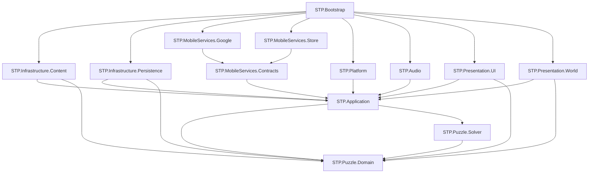

# Module Boundaries v0.1

## 1. Ziel

Modulgrenzen sind Compilerverträge. Ordnernamen allein genügen nicht. Jede Produktionsassembly besitzt eine `.asmdef`, eine dokumentierte Verantwortung und eine Allowlist direkter Referenzen. Zirklen, globale Service-Locator und implizite Szenenabhängigkeiten sind verboten.

## 2. Vorgesehene Repository-Struktur

```text
/
├── AGENTS.md
├── ARCHITECTURE/
├── DECISIONS/
├── PROJECT_CONTROL/
├── WORK_PACKAGES/
├── Content/
│   ├── Levels/<season>/<section>/<route>/*.json
│   ├── Catalogs/*.json
│   ├── Localization/source/
│   └── Schemas/
├── Assets/
│   └── StammstreckenPuzzle/
│       ├── Scripts/
│       │   ├── Puzzle/Domain/
│       │   ├── Puzzle/Solver/
│       │   ├── Application/
│       │   ├── Infrastructure/Content/
│       │   ├── Infrastructure/Persistence/
│       │   ├── MobileServices/
│       │   ├── Presentation/UI/
│       │   ├── Presentation/World/
│       │   ├── Audio/
│       │   ├── Bootstrap/
│       │   └── Editor/
│       ├── UI/
│       ├── Art/
│       ├── Audio/
│       ├── Localization/
│       ├── Scenes/
│       └── Generated/
├── Tests/
│   ├── EditMode/
│   ├── PlayMode/
│   ├── Device/
│   ├── Fixtures/
│   └── Golden/
├── Packages/
├── ProjectSettings/
└── .github/workflows/
```

`Assets/StammstreckenPuzzle/Generated/` wird ausschließlich von versionierten Importern beschrieben. Authoringquellen bleiben unter `Content/`. Temporäre Unity-Verzeichnisse wie `Library`, `Temp`, `Logs`, `UserSettings` und lokale Builds werden ignoriert.

## 3. Produktionsassemblies

Die folgende Tabelle ist die **einzige normative Allowlist** direkter Assembly- und Paketreferenzen. Jede nicht genannte direkte Referenz ist verboten. `Domain Read Types` bezeichnet Typen aus `STP.Puzzle.Domain` und ist keine zusätzliche Assembly. CI liest beziehungsweise spiegelt diese Tabelle in einer versionierten maschinenprüfbaren Allowlist; ein Unterschied zwischen Dokument und Prüfliste blockiert den Merge.

| Assembly | Verantwortung | Direkte Referenzen |
|---|---|---|
| `STP.Puzzle.Domain` | Werteobjekte, Puzzledefinition, Sessionstate, Commands, Invarianten und Completion. | Keine. `noEngineReferences: true`. |
| `STP.Puzzle.Solver` | Constraintmodell, Propagation, Suche, Proof und Deduktionsspur. | `STP.Puzzle.Domain`. `noEngineReferences: true`. |
| `STP.Application` | Use Cases, Fortschritt, Ökonomie, Policies, Read Models und Ports. | Domain, Solver. `noEngineReferences: true`. |
| `STP.Infrastructure.Content` | JSON-Parsing, Schema-/Semantikadapter, Katalog und Addressable-Mapping. | Application, Domain, Newtonsoft Json, Addressables. |
| `STP.Infrastructure.Persistence` | Save-Serializer, atomare Dateien, Migrationen, Checksummen und Backup. | Application, Domain, Newtonsoft Json. |
| `STP.MobileServices.Contracts` | Anbieterfreie Adapter-DTOs, Fehlercodes und Konfigurationsverträge. | Application. |
| `STP.MobileServices.Google` | Mobile Ads, UMP, Firebase Analytics und Crashlytics. | MobileServices.Contracts und jeweilige SDKs. |
| `STP.MobileServices.Store` | Unity-IAP-Adapter und Storetransaktionsmapping. | MobileServices.Contracts, Unity IAP. |
| `STP.Platform` | App-Lifecycle, Netzwerkstatus, Safe Area, Haptik und Plattforminformationen. | Application, UnityEngine/Input System. |
| `STP.Audio` | Audio-Cue-Mapping, AudioMixer und Lifecycle. | Application, UnityEngine, Addressables. |
| `STP.Presentation.UI` | UI Toolkit Screens, Presenter, Custom Grid und Navigation. | Application, Domain Read Types, UI Toolkit, Input System, Localization. |
| `STP.Presentation.World` | Zugfahrt, Kartenwelt, 2D-/2.5D-Renderer und Animation. | Application, Domain Read Types, UnityEngine, URP, Addressables. |
| `STP.Bootstrap` | Composition Root, Startreihenfolge, Buildkonfiguration und Szenenentry. | Alle konkreten Runtimeassemblies. |
| `STP.Editor.Content` | Import, Authoringfenster, Batchvalidator und Buildkatalog. | Domain, Solver, Infrastructure.Content, UnityEditor. |
| `STP.Editor.Build` | Reproduzierbare Buildentrypoints und Preflight. | Bootstrap-Verträge, UnityEditor. |

`STP.Puzzle.Domain`, `STP.Puzzle.Solver` und `STP.Application` enthalten keine Unity-Objekte, Coroutines, Scenes, ScriptableObjects, SDK-Typen oder Dateisystemzugriffe.

## 4. Testassemblies

| Assembly | Testziel |
|---|---|
| `STP.Tests.Domain.EditMode` | Commands, Invarianten, Completion, Properties und Replay. |
| `STP.Tests.Solver.EditMode` | 0/1/2+-Lösungen, Proofs, Metamorphosen, Limits und Performance. |
| `STP.Tests.Application.EditMode` | Fortschritt, Sterne, Rewards, Anzeigenpolicy und Idempotenz mit Fakes. |
| `STP.Tests.Persistence.EditMode` | Roundtrip, Migration, Korruption, atomare Recovery und Ledger. |
| `STP.Tests.Content.EditMode` | Schema, Semantik, Katalog und deterministischer Import. |
| `STP.Tests.Presentation.PlayMode` | Navigation, Grid, Fokus, Safe Area, Abschlussreihenfolge und Scene Wiring. |
| `STP.Tests.Mobile.PlayMode` | Adaptercontracts mit Fakes und Sandbox-Stubs. |
| `STP.Tests.Device` | Reale Android-/iOS-Lifecycle-, Store-, Consent-, Ads- und Crash-Smokes. |

Tests dürfen Produktionsassemblies referenzieren. Produktionsassemblies dürfen nie Testassemblies oder Fixturepfade referenzieren.

## 5. Abhängigkeitsgraph

Der folgende Graph ist eine **nicht normative Visualisierung ausschließlich interner Assemblykanten**. Externe Unity-/SDK-Pakete werden aus Gründen der Lesbarkeit nicht dargestellt. Bei jeder Abweichung gilt ausschließlich die Tabelle in Abschnitt 3; der Dokumentkonsistenztest muss eine solche Abweichung melden.



Pfeile bedeuten „referenziert“. Die Verbotswirkung stammt aus der normativen Tabelle, nicht aus der Visualisierung.

## 6. Application-Ports

| Port | Minimale Verantwortung | Verbotene Verantwortung |
|---|---|---|
| `ISaveRepository` | Snapshot laden, atomar speichern, Backupstatus melden. | Fortschritt berechnen. |
| `ILevelCatalog` | Definition nach stabiler ID liefern und Katalogrevision melden. | Spielerzustand verändern. |
| `IClock` | UTC für Tagesgrenzen und monotone aktive Zeit liefern. | Wanduhr als Rätseltimer verwenden. |
| `IAdsPort` | Verfügbarkeit, Load, Show und typisiertes Ergebnis. | Werbefrequenz oder Zeitpunkt entscheiden. |
| `IPurchasePort` | Produkte, Kauf, Pending, Restore und Belegreferenz abbilden. | Entitlement direkt vergeben. |
| `IConsentPort` | Status aktualisieren, Optionen zeigen, Fähigkeiten freigeben. | Produktnavigation blockieren. |
| `IAnalyticsPort` | freigegebene, schema-konforme Events senden. | Gameplay-Wahrheit speichern. |
| `ICrashReportingPort` | nicht personenbezogene Keys, Logs und Exceptions senden. | Save-Inhalte hochladen. |
| `IAudioPort` | semantische Cues, Gruppenlautstärke und Pause. | Clipnamen an Application liefern. |
| `IAppLifecyclePort` | Foreground, Background, Suspend und Quit melden. | Puzzlezeit selbst berechnen. |
| `INetworkStatusPort` | grobe Erreichbarkeit als Hinweis liefern. | Erfolg eines Dienstaufrufs garantieren. |
| `IHapticsPort` | semantische Haptik-Cues ausführen. | Gameplayfeedback als Richtigkeitsurteil erfinden. |

Jeder asynchrone Port nimmt einen Cancellation-Token und liefert einen diskriminierten Status wie `Succeeded`, `Unavailable`, `NotAllowed`, `Cancelled`, `TimedOut`, `Pending` oder `Failed`. Anbieterexceptions überschreiten die Adaptergrenze nicht.

## 7. Composition Root und Lifecycle

`STP.Bootstrap` ist der einzige Ort, an dem konkrete Implementierungen gewählt werden. Die Composition Root erstellt Abhängigkeiten in folgender Reihenfolge: Konfiguration, lokaler Logger, Content, Persistenz, Clock/Lifecycle, Application, Presentation und erst danach erlaubte externe Adapter.

MonoBehaviours dienen ausschließlich als Unity-Lifecycle- und Renderingadapter. Sie besitzen keine fachliche Entscheidungslogik. Szenen enthalten keine gegenseitigen Suchabhängigkeiten. Jede Szene hat genau einen dokumentierten Entry-Installer, der von Bootstrap gespeist wird.

## 8. Daten- und Threadgrenzen

Domain und Application laufen seriell auf einem logischen Application-Thread. SDK-Callbacks und Hintergrund-I/O werden in unveränderliche Ergebnisse übersetzt und vor Zustandsmutation auf diesen Thread gestellt. Render- und UI-Objekte werden ausschließlich auf dem Unity-Hauptthread berührt.

Große Daten werden nicht global gecacht. Leveldefinitionen sind immutable und nach ID cachebar. Save-Snapshots werden nach erfolgreichem Commit ausgetauscht. Eventhandler werden über explizite Subscriptions mit Lebensdauer verwaltet; anonyme globale statische Events sind verboten.

## 9. Maschinenprüfbare Grenzregeln

CI prüft mindestens:

- `.asmdef`-Referenzen gegen eine Allowlist;
- `noEngineReferences` für Domain, Solver und Application;
- keine SDK-Namensräume außerhalb zuständiger Adapter;
- keine `UnityEngine`-Referenz in reinen Assemblies;
- keine Aufrufe von `PlayerPrefs` außerhalb eines ausdrücklich erlaubten Einstellungsadapters;
- keine `Resources.Load`-Aufrufe im Projektcode;
- keine statischen veränderlichen Service-Instanzen;
- keine sichtbaren Stringliterale in Presentern;
- keine direkten Dateisystem- oder Netzwerkaufrufe aus Domain/Application;
- keine zirkulären Assemblyabhängigkeiten.

## 10. Regeln für neue Agenten

Ein Agent ändert genau ein fachlich kohärentes Modul pro Work Package. Er liest zuerst den zuständigen Architekturvertrag und bestehende Tests. Neue öffentliche Typen benötigen XML-Dokumentation und Contracttests. Eine neue Assembly, ein neuer Port oder eine neue direkte Referenz ist eine Architekturänderung und benötigt vor Implementierung ADR-Prüfung.

## Referenzen

[1]: ../DECISIONS/ADR-003-domain-trennung-und-modulgrenzen.md "ADR-003 – Reine Puzzle-Domain und gerichtete Modulgrenzen"
[2]: ./ARCHITECTURE.md "Stammstrecken-Puzzle – Architecture v0.1"
[3]: ./TEST_STRATEGY.md "Test Strategy v0.1"
