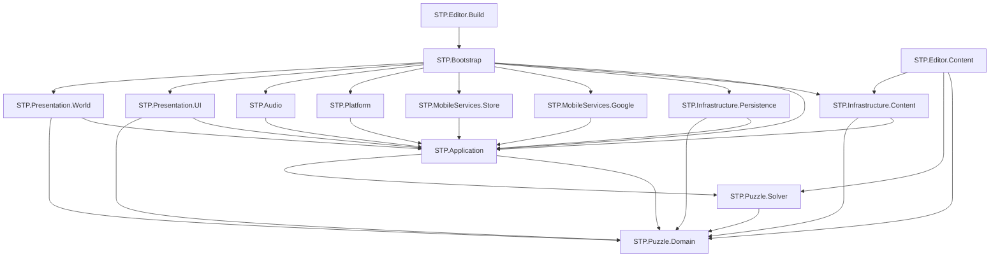

# Module Boundaries v0.3

## 1. Ziel

Modulgrenzen sind Compilerverträge. Ordnernamen allein genügen nicht. Jede Produktionsassembly besitzt eine `.asmdef`, eine dokumentierte Verantwortung und eine Allowlist direkter Referenzen. Zirkeln, globale Service-Locator und implizite Szenenabhängigkeiten sind verboten.

## 2. Vorgesehene Repository-Struktur

```text
/
├── AGENTS.md
├── ARCHITECTURE/
├── DECISIONS/
├── PROJECT_CONTROL/
├── WORK_PACKAGES/
├── Content/
│   ├── Levels/<season>/<section>/<route>/*.json
│   ├── Catalogs/*.json
│   ├── Localization/source/
│   └── Schemas/
├── Assets/
│   └── StammstreckenPuzzle/
│       ├── Scripts/
│       │   ├── Puzzle/Domain/
│       │   ├── Puzzle/Solver/
│       │   ├── Application/
│       │   ├── Infrastructure/Content/
│       │   ├── Infrastructure/Persistence/
│       │   ├── MobileServices/Google/
│       │   ├── MobileServices/Store/
│       │   ├── Platform/
│       │   ├── Presentation/UI/
│       │   ├── Presentation/World/
│       │   ├── Audio/
│       │   ├── Bootstrap/
│       │   └── Editor/
│       ├── Tests/
│       │   ├── EditMode/
│       │   │   ├── Domain/
│       │   │   ├── Solver/
│       │   │   ├── Application/
│       │   │   ├── Persistence/
│       │   │   └── Content/
│       │   ├── PlayMode/
│       │   │   ├── Presentation/
│       │   │   ├── Mobile/
│       │   │   └── Bootstrap/
│       │   ├── Device/
│       │   ├── Fixtures/
│       │   └── Golden/
│       ├── UI/
│       ├── Art/
│       ├── Audio/
│       ├── Localization/
│       ├── Scenes/
│       └── Generated/
├── tools/architecture-validation/
├── Packages/
├── ProjectSettings/
└── .github/workflows/
```

`Assets/StammstreckenPuzzle/Generated/` wird ausschließlich von versionierten Importern beschrieben. Authoringquellen bleiben unter `Content/`. Temporäre Unity-Verzeichnisse wie `Library`, `Temp`, `Logs`, `UserSettings` und lokale Builds werden ignoriert.

Die Unity-Testassemblies liegen physisch unter `Assets/StammstreckenPuzzle/Tests/`. Ein gewöhnlicher repositorywurzeliger `Tests/`-Ordner außerhalb von `Assets/` oder einem eingebundenen Unity-Package wird vom Unity-Editor nicht als normale Unity-Testassembly importiert; eine frühere Fassung dieses Dokuments zeigte einen solchen wurzeligen Ordner und war damit eine Dokumentationsungenauigkeit (B-01, Klarstellung durch WP-010). Die logischen Assemblynamen aus Abschnitt 4 ändern sich durch den physischen Standort nicht.

## 3. Einzige normative Produktionsassembly-Allowlist

Die folgende Tabelle ist die **einzige normative Allowlist interner direkter Assemblyreferenzen**. Eine nicht genannte direkte interne Referenz ist verboten. Externe Paketreferenzen stehen nach einem Semikolon und werden getrennt geprüft. „Domain Read Types“ ist keine Assembly; Präsentationsassemblies referenzieren hierfür direkt `STP.Puzzle.Domain`.

| Assembly | Verantwortung | Direkte interne Referenzen | Zulässige externe Pakete |
|---|---|---|---|
| `STP.Puzzle.Domain` | Werteobjekte, Puzzledefinition, Sessionstate, Commands, Invarianten und Completion. | Keine. | .NET/C#-Basisbibliothek; `noEngineReferences: true`. |
| `STP.Puzzle.Solver` | Constraintmodell, Propagation, Suche, Proof und Deduktionsspur. | `STP.Puzzle.Domain` | .NET/C#-Basisbibliothek; `noEngineReferences: true`. |
| `STP.Application` | Use Cases, Fortschritt, Economy, Policies, Read Models und sämtliche providerneutralen Ports/Ergebnisunionen. | `STP.Puzzle.Domain`, `STP.Puzzle.Solver` | .NET/C#-Basisbibliothek; `noEngineReferences: true`. |
| `STP.Infrastructure.Content` | JSON-Parsing, Schema-/Semantikadapter, Level-/Katalogports und Addressable-Mapping. | `STP.Application`, `STP.Puzzle.Domain` | Newtonsoft Json, Addressables. |
| `STP.Infrastructure.Persistence` | Save-Serializer, atomare Dateien, Migrationen, Hashprofile, Ledgercheckpoint und Backup. | `STP.Application`, `STP.Puzzle.Domain` | Newtonsoft Json. |
| `STP.MobileServices.Google` | Mobile Ads, UMP und Firebase Analytics; implementiert Application-Ports. Crashdiagnose bleibt lokal. | `STP.Application` | gepinnte Google-Mobile-Ads-/Firebase-Analytics-SDKs; kein Crashlytics in Production. |
| `STP.MobileServices.Store` | Unity-IAP-Adapter, lokale Belegprüfung und Storetransaktionsmapping; implementiert `IPurchasePort`. | `STP.Application` | Unity IAP. |
| `STP.Platform` | App-Lifecycle, Netzwerkstatus, Safe Area, Haptik und Plattforminformationen. | `STP.Application` | UnityEngine, Input System. |
| `STP.Audio` | Audio-Cue-Mapping, AudioMixer und Lifecycle. | `STP.Application` | UnityEngine, Addressables. |
| `STP.Presentation.UI` | UI Toolkit Screens, Presenter, Custom Grid und Navigation. | `STP.Application`, `STP.Puzzle.Domain` | UI Toolkit, Input System, Localization. |
| `STP.Presentation.World` | Zugfahrt, Kartenwelt, 2D-/2.5D-Renderer und Animation. | `STP.Application`, `STP.Puzzle.Domain` | UnityEngine, URP, Addressables. |
| `STP.Bootstrap` | Composition Root, Startreihenfolge, Buildkonfiguration und Szenenentry. | `STP.Application`, `STP.Infrastructure.Content`, `STP.Infrastructure.Persistence`, `STP.MobileServices.Google`, `STP.MobileServices.Store`, `STP.Platform`, `STP.Audio`, `STP.Presentation.UI`, `STP.Presentation.World` | UnityEngine. |
| `STP.Editor.Content` | Import, Authoringfenster, Batchvalidator und Buildkatalog. | `STP.Puzzle.Domain`, `STP.Puzzle.Solver`, `STP.Infrastructure.Content` | UnityEditor. |
| `STP.Editor.Build` | Reproduzierbare Buildentrypoints und Preflight. | `STP.Bootstrap` | UnityEditor. |

Es existieren weder `STP.MobileServices.Contracts` noch eine Assembly „Bootstrap-Verträge“. Providerneutrale Ports gehören dem inneren Verbraucher `STP.Application`; konkrete Adapter hängen davon ab. `STP.Puzzle.Domain`, `STP.Puzzle.Solver` und `STP.Application` enthalten keine Unity-Objekte, Coroutines, Scenes, ScriptableObjects, SDK-Typen oder Dateisystemzugriffe.

## 4. Testassemblies

| Assembly | Physische Testassembly (.asmdef-Pfad) | Testziel |
|---|---|---|
| `STP.Tests.Domain.EditMode` | `Assets/StammstreckenPuzzle/Tests/EditMode/Domain/` | Commands, Invarianten, Ein-Zellen-Completion, Properties und Replay. |
| `STP.Tests.Solver.EditMode` | `Assets/StammstreckenPuzzle/Tests/EditMode/Solver/` | 0/1/2+-Lösungen, Proofs, Metamorphosen, Limits und Performance. |
| `STP.Tests.Application.EditMode` | `Assets/StammstreckenPuzzle/Tests/EditMode/Application/` | Fortschritt, Sterne, Rewards, Cosmetics, Anzeigenpolicy und Idempotenz mit Fakes. |
| `STP.Tests.Persistence.EditMode` | `Assets/StammstreckenPuzzle/Tests/EditMode/Persistence/` | Roundtrip, Hashprofile, Migration, Korruption, atomare Recovery und Ledgerkompaktierung. |
| `STP.Tests.Content.EditMode` | `Assets/StammstreckenPuzzle/Tests/EditMode/Content/` | Level-/Katalogschema, Semantik, Cross-References und deterministischer Import. |
| `STP.Tests.Presentation.PlayMode` | `Assets/StammstreckenPuzzle/Tests/PlayMode/Presentation/` | Navigation, Grid, Fokus, Safe Area, Abschlussreihenfolge und Scene Wiring. |
| `STP.Tests.Mobile.PlayMode` | `Assets/StammstreckenPuzzle/Tests/PlayMode/Mobile/` | Adaptercontracts mit Fakes und Sandbox-Stubs. |
| `STP.Tests.Bootstrap.PlayMode` | `Assets/StammstreckenPuzzle/Tests/PlayMode/Bootstrap/` | Compile-/Composition-Smoke `BootstrapCompositionSmoke` inklusive QA-Szene. |
| `STP.Tests.Device` | `Assets/StammstreckenPuzzle/Tests/Device/` | Physische Android-/iOS-Lifecycle-, Store-, Consent-, Ads-, Telemetrie- und Crash-Smokes. |

Jede Testassembly besitzt ihre gleichnamige `.asmdef`-Datei direkt in ihrem physischen Verzeichnis. `Assets/StammstreckenPuzzle/Tests/Fixtures/` und `Assets/StammstreckenPuzzle/Tests/Golden/` enthalten keine `.asmdef` und sind reine Testdatenordner. EditMode-Assemblies bleiben Editor-only; PlayMode- und Device-Assemblies bleiben nach den bestehenden Verträgen ausführbar und erhalten die korrekte Unity-Testkonfiguration.

Tests dürfen Produktionsassemblies referenzieren. Produktionsassemblies dürfen nie Testassemblies oder Fixturepfade referenzieren.

## 5. Nicht normative Visualisierung der internen Kanten

Der Graph visualisiert ausschließlich die in Abschnitt 3 erlaubten internen Kanten. Bei Abweichung gilt die Tabelle; der Dokumentkonsistenztest muss jede Abweichung melden.



Pfeile bedeuten „referenziert“. Der Graph ist azyklisch. Die Verbotswirkung stammt aus Abschnitt 3.

## 6. Normative Application-Ports

| Port | Implementierendes Modul | Minimale Verantwortung | Verbotene Verantwortung |
|---|---|---|---|
| `ISaveRepository` | `STP.Infrastructure.Persistence` | Snapshot laden, atomar speichern, Backupstatus melden. | Fortschritt berechnen. |
| `ILevelCatalog` | `STP.Infrastructure.Content` | Definition nach stabiler ID liefern und Katalogrevision melden. | Spielerzustand verändern. |
| `ICampaignCatalog` | `STP.Infrastructure.Content` | Hierarchie, Reihenfolge und Unlockdefinitionen liefern. | Fortschritt schreiben. |
| `ICompletionCatalog` | `STP.Infrastructure.Content` | Reward- und Completiondefinitionen liefern. | Rewardberechtigung oder Ledger mutieren. |
| `ICosmeticsCatalog` | `STP.Infrastructure.Content` | Itemstatus, Preis und Referenzen liefern. | Ownership vergeben oder Saldo prüfen. |
| `IClock` | `STP.Platform` | UTC für ausdrücklich freigegebene Policies und monotone aktive Zeit liefern. | Wanduhr als Rätseltimer verwenden. |
| `IAdsPort` | `STP.MobileServices.Google` | Verfügbarkeit, Load, Show und typisiertes Ergebnis. | Werbefrequenz oder Zeitpunkt entscheiden. |
| `IPurchasePort` | `STP.MobileServices.Store` | Produkte, Kaufbeleg, lokale Prüfung, Acknowledge/Finish, Pending, Restore und Revocation abbilden. | Entitlement direkt vergeben. |
| `IConsentPort` | `STP.MobileServices.Google` | Status aktualisieren, Optionen zeigen, explizite Capabilities liefern. | Produktnavigation blockieren oder unklare Zustände freigeben. |
| `IAnalyticsPort` | `STP.MobileServices.Google` | freigegebene, schema-konforme Events senden. | Gameplay-Wahrheit speichern oder vor Capability senden. |
| `ICrashReportingPort` | `STP.MobileServices.Google` | freigegebene Keys, Logs und Exceptions senden. | Save-Inhalte hochladen oder vor Capability aktivieren. |
| `IAudioPort` | `STP.Audio` | semantische Cues, Gruppenlautstärke und Pause. | Clipnamen an Application liefern. |
| `IAppLifecyclePort` | `STP.Platform` | Foreground, Background, Suspend und Quit melden. | Puzzlezeit selbst berechnen. |
| `INetworkStatusPort` | `STP.Platform` | grobe Erreichbarkeit als Hinweis liefern. | Erfolg eines Dienstaufrufs garantieren. |
| `IHapticsPort` | `STP.Platform` | semantische Haptik-Cues ausführen. | Gameplayfeedback als Richtigkeitsurteil erfinden. |

`ISaveSyncPort` existiert nicht. Eine Cloudfunktion benötigt zuerst bestätigte Konto-, Datenschutz- und Konfliktregeln sowie ein ersetzendes ADR. Jeder asynchrone Port nimmt Cancellation und liefert einen diskriminierten Status wie `Succeeded`, `Unavailable`, `NotAllowed`, `Cancelled`, `TimedOut`, `Pending` oder `Failed`. Anbieterexceptions überschreiten die Adaptergrenze nicht.

## 7. Composition Root und Lifecycle

`STP.Bootstrap` ist der einzige Ort, an dem konkrete Implementierungen gewählt werden. Die direkte Referenz auf `STP.Application` ist erforderlich, damit die Root Use Cases und deren providerneutrale Ports kompilierbar verdrahten kann. Domain und Solver bleiben transitive innere Abhängigkeiten; Bootstrap referenziert sie nicht direkt. Die Composition Root erstellt Abhängigkeiten in folgender Reihenfolge: Konfiguration, lokaler Logger, Content, Persistenz, Clock/Lifecycle, Application, Presentation und erst danach erlaubte externe Adapter.

Eine erlaubte Assemblyreferenz ist **keine** Initialisierungsfreigabe. Ads, IAP, Analytics und Crashdiagnose dürfen erst nach ihren eigenen Capability-, Privacy- und Recovery-Gates gestartet werden. Service Locator, veränderliche Singleton-Registry, Reflexions-Wiring und Szenensuche sind keine zulässigen Ersatzmechanismen.

Der erste Produktions-Scaffold muss zusätzlich einen Compile-/Composition-Smoke `STP.Tests.Bootstrap.PlayMode.BootstrapCompositionSmoke` bereitstellen, physisch als `Assets/StammstreckenPuzzle/Tests/PlayMode/Bootstrap/BootstrapCompositionSmoke.cs` in der Assembly `STP.Tests.Bootstrap.PlayMode`. Er kompiliert die echte `.asmdef`-Kante, startet die Root in der dedizierten QA-Szene `Assets/StammstreckenPuzzle/Scenes/QA/BootstrapComposition.unity` und belegt genau ein Binding pro Application-Port, vollständigen Application-/UI-/World-Graphen, keine nicht dokumentierten Null-/Fallback-Ports und keinen optionalen Providerstart. Dieser Test ist ohne Unity-Scaffold **REQUIRED_LATER/NOT_EXECUTED** und kein lokaler v0.3-PASS.

MonoBehaviours dienen ausschließlich als Unity-Lifecycle- und Renderingadapter. Sie besitzen keine fachliche Entscheidungslogik. Szenen enthalten keine gegenseitigen Suchabhängigkeiten. Jede Szene hat genau einen dokumentierten Entry-Installer, der von Bootstrap gespeist wird.

## 8. Daten- und Threadgrenzen

Domain und Application laufen seriell auf einem logischen Application-Thread. SDK-Callbacks und Hintergrund-I/O werden in unveränderliche Ergebnisse übersetzt und vor Zustandsmutation auf diesen Thread gestellt. Render- und UI-Objekte werden ausschließlich auf dem Unity-Hauptthread berührt.

Level- und Katalogdefinitionen sind immutable und nach stabiler ID cachebar. Save-Snapshots werden nach erfolgreichem Commit ausgetauscht. Eventhandler werden über explizite Subscriptions mit Lebensdauer verwaltet; anonyme globale statische Events sind verboten.

## 9. Maschinenprüfbare Grenzregeln

CI und der Architekturvalidator prüfen mindestens:

- `.asmdef`-Referenzen gegen die Allowlist aus Abschnitt 3;
- die Bootstrap-Referenzmenge exakt gegen die neun in Abschnitt 3 genannten internen Ziele;
- die Mermaid-Kantenmenge exakt gegen die normative Tabelle;
- ausschließlich bekannte konkrete Assemblyknoten;
- Azyklizität des internen Graphen;
- `noEngineReferences` für Domain, Solver und Application;
- keine SDK-Namensräume außerhalb zuständiger Adapter;
- keine `UnityEngine`-Referenz in reinen Assemblies;
- keine Aufrufe von `PlayerPrefs` außerhalb eines ausdrücklich erlaubten Einstellungsadapters;
- keine `Resources.Load`-Aufrufe im Projektcode;
- keine statischen veränderlichen Service-Instanzen;
- keine sichtbaren Stringliterale in Presentern;
- keine direkten Dateisystem- oder Netzwerkaufrufe aus Domain/Application.

## 10. Regeln für neue Agenten

Ein Work Package beschreibt **eine fachlich kohärente, einzeln testbare Änderung mit explizit aufgelisteten betroffenen Modulen**. Wenn eine vollständige architektonische Transaktion mehrere Module zwingend gemeinsam ändern muss, werden diese im selben Work Package geändert. Beiläufige Refactorings oder nicht aufgelistete Module bleiben verboten.

Ein Agent liest zuerst die zuständigen Architekturverträge und bestehenden Tests. Neue öffentliche Typen benötigen XML-Dokumentation und Contracttests. Eine neue Assembly, ein neuer Port oder eine neue direkte Referenz ist eine Architekturänderung und benötigt vor Implementierung ADR-Prüfung.

## Referenzen

[1]: ../DECISIONS/ADR-013-zyklusfreie-ports-und-modulgrenzen.md "ADR-013 – Zyklusfreie Ports und Modulgrenzen"
[2]: ./ARCHITECTURE.md "Stammstrecken-Puzzle – Architecture v0.3"
[3]: ./TEST_STRATEGY.md "Test Strategy v0.3"
[4]: ../PROJECT_CONTROL/WORK_PACKAGE_RULES.md "Regeln für Work Packages"
[5]: ../DECISIONS/ADR-018-bootstrap-composition-root.md "ADR-018 – Kompilierbare Bootstrap-Composition-Root"
